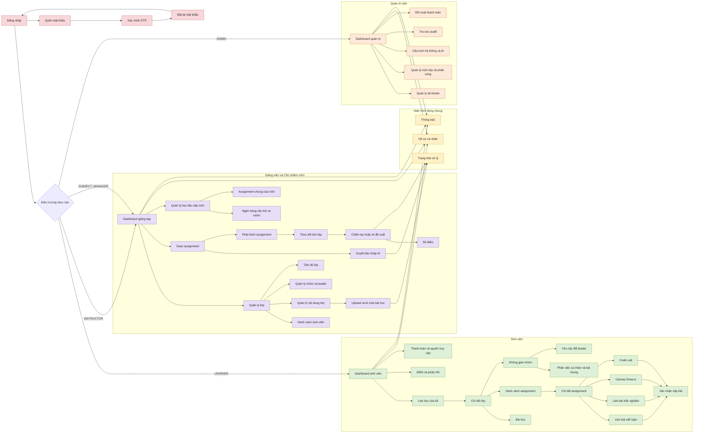

# 5. System Functionalities

Phần này cung cấp tổng quan chức năng của nền tảng học tập có hỗ trợ AI, bao gồm các màn hình, tích hợp API bên ngoài và background job. Hệ thống là web application desktop-first; frontend chỉ gọi backend, không gọi trực tiếp worker hoặc các dịch vụ lưu trữ/AI.

## 5.1 Screen Inventory

### a. Screen Flow

Sơ đồ dưới đây thể hiện các màn hình chính và quan hệ điều hướng. Màu sắc phân biệt khu vực dùng chung, sinh viên, giảng viên/Chủ nhiệm môn và quản trị viên.

**Text alternative:** Sau đăng nhập, hệ thống điều hướng theo `role`. Sinh viên truy cập lớp, bài học, assignment, nhóm, bài nộp, điểm và thanh toán. Giảng viên quản lý lớp, nội dung, nhóm, assignment, bài nộp và điểm. Chủ nhiệm môn dùng cùng khu vực giảng dạy và có thêm phạm vi học liệu, ngân hàng câu hỏi, rubric và assignment chung của môn. Quản trị viên quản lý tài khoản, môn/lớp, cấu hình, audit và đối soát.

### b. Screen List

| # | Screen ID | Screen Name | Role | Feature | Description |
|---:|---|---|---|---|---|
| 1 | SCR-AUTH-01 | Đăng nhập | Tất cả | Authentication | Cho phép đăng nhập bằng email trường và mật khẩu; hiển thị lỗi trung tính và hỗ trợ rate limiting. |
| 2 | SCR-AUTH-02 | Quên mật khẩu | Tất cả | Authentication | Gửi yêu cầu OTP đặt lại mật khẩu mà không tiết lộ email có tồn tại hay không. |
| 3 | SCR-AUTH-03 | Xác minh OTP | Tất cả | Authentication | Xác minh OTP có thời hạn, giới hạn số lần nhập sai và không cho tái sử dụng. |
| 4 | SCR-AUTH-04 | Đặt lại mật khẩu | Tất cả | Authentication | Cho phép đặt mật khẩu mới đạt chính sách và thu hồi các session liên quan. |
| 5 | SCR-COM-01 | Hồ sơ cá nhân | Đã đăng nhập | Profile | Xem và cập nhật tên hiển thị cùng thông tin cá nhân được phép. |
| 6 | SCR-COM-02 | Thông báo | Đã đăng nhập | Notification | Hiển thị assignment mới, hạn nộp, quyết định đổi leader, điểm và trạng thái thanh toán. |
| 7 | SCR-COM-03 | Trạng thái xử lý | Đã đăng nhập | Background Processing | Hiển thị tiến độ an toàn của tác vụ AI, xử lý file hoặc xuất dữ liệu do người dùng khởi tạo. |
| 8 | SCR-LRN-01 | Dashboard sinh viên | Sinh viên | Learning | Tổng hợp lớp đang học, assignment sắp đến hạn, thông báo và tiến độ cá nhân. |
| 9 | SCR-LRN-02 | Lớp học của tôi | Sinh viên | Enrollment | Liệt kê các lớp sinh viên đang hoặc đã được ghi danh. |
| 10 | SCR-LRN-03 | Chi tiết lớp | Sinh viên | Class | Hiển thị nội dung đã phát hành, assignment, nhóm và tiến độ trong một lớp. |
| 11 | SCR-LRN-04 | Bài học | Sinh viên | Learning Content | Đọc nội dung, tải file được phép từ Google Drive và tiếp tục tại vị trí gần nhất. |
| 12 | SCR-LRN-05 | Danh sách assignment | Sinh viên | Assignment | Liệt kê bài đang mở, sắp mở, đã nộp, quá hạn và đã chấm. |
| 13 | SCR-LRN-06 | Chi tiết assignment | Sinh viên | Assignment | Hiển thị yêu cầu, rubric, thời hạn, số lần nộp và trạng thái bài. |
| 14 | SCR-LRN-07 | Làm bài viết luận | Sinh viên | Assignment Workspace | Soạn và tự lưu bài viết luận trước khi xác nhận nộp. |
| 15 | SCR-LRN-08 | Làm bài trắc nghiệm | Sinh viên | Assignment Workspace | Trả lời câu hỏi trắc nghiệm và xem trạng thái lưu nháp. |
| 16 | SCR-LRN-09 | Canvas Draw.io | Sinh viên | Diagram Assignment | Vẽ sơ đồ trên canvas và nộp XML Draw.io đầy đủ; XML rút gọn không được người học nộp. |
| 17 | SCR-LRN-10 | Code Lab | Sinh viên | Code Assignment | Viết, chạy thử trong sandbox và nộp mã nguồn theo giới hạn đề bài. |
| 18 | SCR-LRN-11 | Xác nhận nộp bài | Sinh viên | Submission | Kiểm tra nội dung/artifact, attempt và thời hạn trước khi tạo bài nộp bất biến cùng biên nhận. |
| 19 | SCR-LRN-12 | Không gian nhóm | Sinh viên | Group Work | Hiển thị nhóm, leader, thành viên, bài chung và trạng thái đóng góp. |
| 20 | SCR-LRN-13 | Phần việc cá nhân và tài liệu chung | Sinh viên | Group Assignment | Cho từng thành viên nộp phần được giao và xem trạng thái composite do hệ thống tạo/giảng viên chốt. |
| 21 | SCR-LRN-14 | Yêu cầu đổi leader | Sinh viên | Group Work | Gửi lý do và người đề xuất để giảng viên xem xét thay đổi leader. |
| 22 | SCR-LRN-15 | Điểm và phản hồi | Sinh viên | Grading | Hiển thị điểm cuối cùng đã công bố và phản hồi của chính sinh viên. |
| 23 | SCR-LRN-16 | Thanh toán và quyền truy cập | Sinh viên | Payment | Chọn gói, chuyển đến cổng thanh toán và theo dõi payment/access grant. |
| 24 | SCR-TCH-01 | Dashboard giảng dạy | Giảng viên/Chủ nhiệm môn | Teaching | Tổng hợp lớp/môn được phân công, bài nộp cần xử lý và tiến độ liên quan. |
| 25 | SCR-TCH-02 | Quản lý lớp | Giảng viên | Class Management | Cập nhật thông tin, trạng thái và nội dung của lớp được phân công. |
| 26 | SCR-TCH-03 | Danh sách sinh viên | Giảng viên | Enrollment | Xem, thêm hoặc gỡ ghi danh mà không xóa lịch sử học tập. |
| 27 | SCR-TCH-04 | Quản lý nội dung lớp | Giảng viên | Learning Content | Soạn, upload, sắp xếp, duyệt và xuất bản nội dung riêng của lớp. |
| 28 | SCR-TCH-05 | Nguồn học liệu và AI chia bài học | Giảng viên/Chủ nhiệm môn | AI Content | Upload DOCX/PDF hoặc gắn YouTube/playlist, theo dõi caption/phiên âm/RAG và duyệt lesson nháp. |
| 29 | SCR-TCH-06 | Quản lý nhóm và leader | Giảng viên | Group Management | Tạo nhóm, thêm thành viên, chỉ định đúng một leader, chia phần việc và xử lý yêu cầu đổi leader. |
| 30 | SCR-TCH-07 | Soạn assignment | Giảng viên/Chủ nhiệm môn | Assignment Authoring | Tạo bài viết luận, trắc nghiệm, Draw.io, Code Lab, bài nhóm hoặc simulation và gắn rubric/version. |
| 31 | SCR-TCH-08 | Duyệt bản nháp AI | Giảng viên/Chủ nhiệm môn | AI Authoring | Xem căn cứ, sửa, chấp nhận hoặc bỏ nội dung do AI đề xuất trước khi lưu. |
| 32 | SCR-TCH-09 | Phát hành assignment | Giảng viên/Chủ nhiệm môn | Assignment Publication | Chọn lớp, thời gian mở/đóng và lượt nộp; đóng băng phiên bản trước khi phát hành. |
| 33 | SCR-TCH-10 | Theo dõi bài nộp | Giảng viên | Submission Monitoring | Lọc chưa nộp, đã nộp, trễ hạn và gửi nhắc nhở tới đúng sinh viên. |
| 34 | SCR-TCH-11 | Chấm bài | Giảng viên | Grading | Sau khi nhận bài, chọn chấm tay hoặc yêu cầu AI đề xuất; bài chung luôn chấm tay. |
| 35 | SCR-TCH-12 | Sổ điểm | Giảng viên | Gradebook | Duyệt, chốt, công bố điểm; với bài nhóm hiển thị điểm phần/composite để giảng viên tự nhập điểm cuối có lý do. |
| 36 | SCR-TCH-13 | Tiến độ lớp | Giảng viên | Progress Tracking | Xem tiến độ tổng hợp và chi tiết phù hợp của sinh viên trong lớp được giao. |
| 37 | SCR-SUB-01 | Quản lý học liệu cấp môn | Chủ nhiệm môn | Subject Content | Quản lý tài liệu/RAG dùng chung của các môn được phân công. |
| 38 | SCR-SUB-02 | Ngân hàng câu hỏi và rubric | Chủ nhiệm môn/Giảng viên được phép | Question Bank | Tạo, sửa, nhân bản, xem trước và phát hành version; attempt đã bắt đầu giữ snapshot. |
| 39 | SCR-SUB-03 | Assignment chung và template của môn | Chủ nhiệm môn | Common Assignment | Biên soạn/phát hành đề chung hoặc template có version để giảng viên copy thành draft riêng. |
| 40 | SCR-TCH-13 | Copy assignment/rubric | Giảng viên | Content Reuse | Chọn lớp nguồn/đích trong phạm vi, tạo bản copy độc lập và xem lineage mà không mang dữ liệu thực thi. |
| 41 | SCR-TCH-14 | Tổng hợp và chấm bài nhóm | Giảng viên | Group Grading | Tạo/xem trước/chốt composite, chấm nhất quán và nhập điểm cuối từng thành viên. |
| 42 | SCR-LRN-15 | Simulation exam | Sinh viên | Simulation | Hiển thị lượt, cách lấy kết quả, thời điểm hiện đáp án, trạng thái tính điểm và nhãn thi thử. |
| 40 | SCR-ADM-01 | Dashboard quản trị | Quản trị viên | Administration | Tổng hợp trạng thái tài khoản, môn/lớp, tích hợp và sự kiện cần xử lý. |
| 41 | SCR-ADM-02 | Quản lý tài khoản | Quản trị viên | Identity Administration | Tạo/import tài khoản, đặt role, khóa, mở khóa hoặc vô hiệu hóa tài khoản. |
| 42 | SCR-ADM-03 | Quản lý môn, lớp và phân công | Quản trị viên | Academic Administration | Tạo môn/lớp, chỉ định Chủ nhiệm môn và một giảng viên chính cho mỗi lớp. |
| 43 | SCR-ADM-04 | Cấu hình hệ thống và AI | Quản trị viên | Configuration | Quản lý domain email trường, model AI, quota, giới hạn chi phí và kill switch. |
| 44 | SCR-ADM-05 | Tra cứu audit | Quản trị viên được phép | Audit | Tìm sự kiện theo actor, hành động, đối tượng, kết quả, correlation ID và thời gian. |
| 45 | SCR-ADM-06 | Đối soát thanh toán | Quản trị viên | Payment Operations | Đối chiếu payment, webhook và access grant; xử lý chênh lệch có lý do. |

## 5.2 External API Inventory

External API chỉ được gọi từ backend hoặc worker. Frontend không chứa API key, service-account credential, worker URL hoặc quyền truy cập trực tiếp vào file riêng tư.

| # | API Name | Provider/System | Calling Path | Description |
|---:|---|---|---|---|
| 1 | Google Drive API | Google Workspace | Backend/Worker → Google Drive | Upload, tải và quản lý file DOCX, PDF, slide, Draw.io XML và artifact dẫn xuất bằng `provider_file_id` trong Shared Drive của tổ chức. |
| 2 | Generative AI API | AI Provider | AI Worker → AI Provider | Tóm tắt tài liệu, chia lesson, tạo assignment draft và đề xuất điểm/phản hồi phần cá nhân. Composite nhóm không được gửi để chấm. |
| 6 | YouTube/Transcript Source | YouTube | Content Worker → YouTube | Lấy metadata/caption video hoặc audio stream được phép để phiên âm; URL/provider response được xem là untrusted input. |
| 3 | Payment API | Payment Gateway | Backend → Payment Gateway | Tạo yêu cầu thanh toán, chuyển hướng người dùng và truy vấn trạng thái khi đối soát. |
| 4 | Payment Webhook | Payment Gateway | Payment Gateway → Backend | Thông báo kết quả giao dịch có chữ ký; backend xác minh trước khi đánh dấu `PAID` và cấp access grant. |
| 5 | Email Delivery API | Email Provider/Google Workspace | Notification Worker → Email Provider | Gửi OTP, thông báo assignment, nhắc hạn, quyết định đổi leader, điểm và trạng thái thanh toán. |
| 6 | Code Execution API | Sandbox Provider hoặc dịch vụ cô lập nội bộ | Code Worker → Sandbox | Biên dịch/chạy code với CPU, memory, time và network policy giới hạn; không cho code người học chạy trong backend. |

### External API Rules

1. Mọi credential được giữ ở backend/worker secret store, không đưa xuống frontend.
2. Google Drive file không được đặt chế độ public; backend kiểm tra object permission trước khi cấp nội dung.
3. Lệnh gọi API có timeout, retry hữu hạn với exponential backoff và correlation ID.
4. Payment webhook phải xác minh chữ ký, số tiền, currency, transaction ID và idempotency.
5. AI output luôn là bản nháp hoặc đề xuất; không tự xuất bản assignment hay tự chốt điểm.
6. Code sandbox mặc định tắt network và hủy execution khi vượt quota.

## 5.3 Background Job Inventory

Background job được backend phát dưới dạng message có version qua RabbitMQ. Worker ACK sau khi xử lý thành công; lỗi tạm thời được retry hữu hạn, lỗi cuối được chuyển tới dead-letter queue. RabbitMQ giữ trạng thái vận chuyển tạm thời, còn kết quả nghiệp vụ được lưu vào PostgreSQL hoặc Google Drive.

| # | Job Name | Group | Trigger | Result | Description |
|---:|---|---|---|---|---|
| 1 | `ARTIFACT_SCAN` | File Processing | File upload hoàn tất | Cập nhật `artifacts.scan_status` | Kiểm tra loại file, kích thước, checksum và nội dung nguy hiểm trước khi cho nghiệp vụ sử dụng. |
| 2 | `DOCUMENT_EXTRACT_INDEX` | Content/RAG | Tài liệu sạch được chọn làm nguồn | Chỉ mục và reference tới nguồn | Trích xuất văn bản, chia đoạn và lập chỉ mục theo đúng phạm vi môn/lớp. |
| 3 | `AI_SUMMARIZE_SPLIT_LESSONS` | AI Content | Người có quyền yêu cầu xử lý DOCX/PDF | `learning_resources` ở trạng thái DRAFT | Tạo tóm tắt và chia tài liệu thành nhiều bài học để giảng viên xem, sửa và duyệt. |
| 4 | `AI_ASSIGNMENT_DRAFT` | AI Authoring | Giảng viên/Chủ nhiệm môn yêu cầu tạo bài | Assignment draft và căn cứ | Tạo câu hỏi, bài viết luận hoặc hướng dẫn từ nguồn được phép; không tự phát hành. |
| 5 | `DRAWIO_COMPACT_XML` | Diagram Processing | Giảng viên chọn AI chấm bài Draw.io | Artifact XML rút gọn dẫn xuất | Đọc XML đầy đủ đã kiểm tra, loại phần không cần cho AI và giữ liên kết với artifact gốc. |
| 6 | `AI_GRADE_PROPOSAL` | AI Grading | Giảng viên chọn “Nhờ AI đề xuất” cho bài cá nhân | Proposed score, feedback và evidence | Phân tích submission/rubric tối thiểu; kết quả chỉ là đề xuất để giảng viên chấp nhận, sửa hoặc bỏ. |
| 7 | `YOUTUBE_TRANSCRIPT_INGEST` | Content/RAG | Video/playlist được gắn vào bài giảng | Transcript artifact, timestamps và index reference | Ưu tiên caption; tự phiên âm khi thiếu caption; trạng thái tách theo video. |
| 8 | `GROUP_COMPOSITE_GENERATE` | Group Submission | Giảng viên yêu cầu ghép ordered part versions | Derived composite artifact/version | Không sửa source; lưu lineage và chỉ dùng version giảng viên chốt để chấm. |
| 7 | `CODE_RUN` | Code Execution | Sinh viên chạy thử/nộp Code Lab hoặc giảng viên kiểm thử đề | Kết quả test được phép hiển thị | Gửi code tới sandbox cô lập, áp dụng quota và trả kết quả đã lọc thông tin nhạy cảm. |
| 8 | `NOTIFICATION_SEND` | Notification | Business event cần thông báo | Cập nhật trạng thái notification | Gửi email/in-app idempotent; lỗi gửi không rollback giao dịch nghiệp vụ gốc. |
| 9 | `PAYMENT_RECONCILE` | Payment | Lịch định kỳ hoặc quản trị viên yêu cầu | Cập nhật payment/access grant có audit | Đối chiếu giao dịch chưa rõ trạng thái với provider và xử lý chênh lệch theo chính sách. |
| 10 | `REPORT_EXPORT` | Reporting | Người có quyền yêu cầu xuất báo cáo | File export trên Google Drive | Tạo bảng điểm hoặc báo cáo lớn ngoài request đồng bộ và chỉ cấp quyền tải có thời hạn. |

### Background Job Rules

1. Message chỉ chứa ID/reference và metadata tối thiểu, không chứa password, raw OTP hoặc service credential.
2. Job phải có `message_id`, `correlation_id`, schema version và idempotency key phù hợp.
3. Worker không tự ý ghi trực tiếp bảng ngoài contract nghiệp vụ; result event được backend xác minh và áp dụng.
4. AI grading chỉ áp dụng cho bài cá nhân; composite nhóm luôn do giảng viên chấm tay.
5. Attempt snapshot giữ assignment/question/rubric version và simulation policy; publication mới không đổi attempt đang làm.
5. Full Draw.io XML là bản nộp chính thức; compact XML chỉ là artifact dẫn xuất cho đúng lần AI xử lý.
6. Job hết retry chuyển dead-letter queue và hiển thị lỗi an toàn cùng hướng xử lý cho người dùng có quyền.
7. Kết quả hoàn tất phải nằm trong bảng nghiệp vụ hoặc Google Drive; không dùng RabbitMQ làm kho lịch sử vĩnh viễn.

## 5.4 Functional Coverage Summary

| Area | Primary screens | External APIs | Background jobs |
|---|---|---|---|
| Identity | Login, OTP, password reset, account administration | Email Delivery API | Notification send |
| Academic | Subject/class administration, enrollments, dashboards | Không bắt buộc | Notification send |
| Learning content | Lesson viewer, content manager, AI lesson review | Google Drive, Generative AI | Scan, extract/index, summarize/split |
| Assignment | Builder, publication, learner workspaces | Generative AI, Code Sandbox | AI draft, compact XML, code run |
| Group work | Group workspace, group management, composite review/grading | Google Drive | Composite generation, notification send |
| Grading | Grading workspace, gradebook, results | Generative AI | AI grade proposal |
| Payment | Payment/access screen, reconciliation | Payment API/Webhook | Payment reconciliation |
| Reporting/Audit | Progress, audit explorer, exports | Google Drive | Report export |
