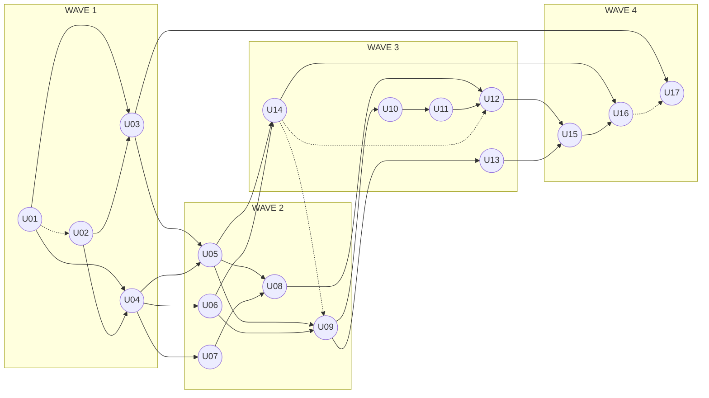

# Unit of Work Dependencies - 17 unit logic

## 1. Ký hiệu và nguyên tắc

Hàng là consumer, cột là provider. `H` cần behavior/contract ổn định trước integration gate; `C` phát triển song song qua contract có version và fake adapter; `E` tiêu thụ event/read model; `-` không phụ thuộc trực tiếp. Không ký hiệu nào cho phép đọc bảng hoặc repository của unit khác. Các unit vẫn thuộc một backend modular monolith; worker là process riêng.

## 2. Dependency matrix

| Consumer \ Provider | U01 | U02 | U03 | U04 | U05 | U06 | U07 | U08 | U09 | U10 | U11 | U12 | U13 | U14 | U15 | U16 | U17 |
|---|---:|---:|---:|---:|---:|---:|---:|---:|---:|---:|---:|---:|---:|---:|---:|---:|---:|
| U01 | - | - | - | - | - | - | - | - | - | - | - | - | - | - | - | - | - |
| U02 | C | - | - | - | - | - | - | - | - | - | - | - | - | - | - | - | - |
| U03 | H | H | - | - | - | - | - | - | - | - | - | - | - | - | - | - | - |
| U04 | H | H | - | - | - | - | - | - | - | - | - | - | - | - | - | - | - |
| U05 | H | H | H | H | - | - | - | - | - | - | - | - | - | - | - | - | - |
| U06 | H | H | - | H | - | - | - | - | - | - | - | - | - | - | - | - | - |
| U07 | H | H | - | H | - | - | - | - | - | - | - | - | - | - | - | - | - |
| U08 | H | - | - | H | H | - | H | - | - | - | - | - | - | - | - | - | - |
| U09 | H | H | - | H | H | H | - | - | - | - | - | - | - | C | - | - | - |
| U10 | - | - | - | H | - | H | - | - | H | - | - | - | - | - | - | - | - |
| U11 | - | - | - | H | - | H | - | - | H | H | - | - | - | - | - | - | - |
| U12 | H | - | H | H | - | H | - | H | H | H | H | - | - | C | - | - | - |
| U13 | H | - | - | H | - | - | - | - | H | - | - | - | - | - | - | - | - |
| U14 | H | H | H | - | H | H | - | - | - | - | - | - | - | - | - | - | - |
| U15 | H | H | H | H | - | - | - | - | H | - | - | H | H | - | - | - | - |
| U16 | H | H | - | H | - | H | - | - | H | - | - | H | - | H | H | - | - |
| U17 | H | H | H | E | E | - | E | - | E | - | - | E | E | - | E | E | - |

### Dependency graph theo wave

Mũi tên liền là cạnh `H` tối giản theo bắc cầu: nếu A → B → C thì không lặp A → C. Mũi tên đứt U01 → U02 và U14 → U09/U12 là tích hợp contract `C`; U16 → U17 minh họa event/read model `E`. Ma trận phía trên vẫn là danh sách đầy đủ, gồm các cạnh `E` khác đi vào U17. Chiều mũi tên luôn từ provider sang consumer. Khung wave là nhóm và điểm dừng tích hợp, **không phải hàng rào đồng bộ**: node ở wave sau có thể mở khi provider trực tiếp của nó xong, dù node khác của wave trước vẫn chạy. Các mũi tên trong cùng khung thể hiện thứ tự mở việc của từng nhánh.

**Diễn giải bằng chữ:** Wave 1 có U01 và U02 khởi động song song; U03/U04 mở khi cả hai cung cấp contract/behavior cần thiết. Wave 2 có U05/U06/U07 song song sau U04; U08 theo U05/U07 và U09 theo U05/U06. Wave 3 có U14 chạy khi nguồn U03/U05/U06 sẵn sàng, trong khi U10/U13 theo U09; U11 theo U10 và U12 theo U08/U11. Wave 4 có U15 sau U12/U13, U16 sau U15/U14 và U17 sau các event của owner. Các nhánh vượt ranh giới wave ngay khi dependency trực tiếp đạt; số unit đang triển khai đồng thời trên toàn nhóm không quá năm.

## 3. Public contract theo luồng

| Luồng | Provider → Consumer | Contract và giới hạn |
|---|---|---|
| Identity → audit/job query | U01 → U02 (`C`) | U02 ghi audit/điều phối job độc lập bằng actor/scope reference; `queryAudit` và `getJobStatus` gọi authorization contract có version, fail closed khi chưa tích hợp |
| Identity, audit, file, job | U01/U02/U03 → mọi unit cần dùng | Actor/resource authorization, append-only audit, scoped artifact, idempotent job; không dùng shared repository |
| Môn/lớp/ghi danh | U04 → U05-U16 khi cần | Subject/class/enrollment reference và scoped authorization |
| Learning access | U04 + U07 + U05 → U08 | Đủ enrollment và entitlement mới trả nội dung đã phát hành; không lưu lesson progress |
| Ngân hàng → đề/attempt/chấm | U06 → U09/U10/U11/U12/U16 | QuestionVersion/RubricVersion immutable và snapshot đúng version |
| Tạo đề | U05/U06 → U14 → U09; U10/U11 cấu hình | U14 trả AI draft proposal; U09 review, sửa, lưu và publish. RAG chỉ hỗ trợ nguồn khi được chọn |
| Đề → attempt | U09/U10/U11 → U12 | Publication, schedule, simulation policy và assignment/question/rubric snapshot; sửa đề tạo version mới |
| Nhóm → phần nộp | U13 + U12 → U15 | Allocation, immutable part submission và ordered source versions; giảng viên chốt composite |
| Chấm | U12/U15/U06 → U16; U14 hỗ trợ | AI chỉ trả proposal; U16 lưu manual/final grade, composite luôn chấm tay |
| Báo cáo/thông báo | Owner events → U17 | Projection theo quyền, outbox delivery; lỗi gửi không rollback transaction nguồn |

### Ranh giới tránh vòng phụ thuộc

- U14 định nghĩa provider-neutral `AiDraftProposal` và `CodeRunResult`; U09/U12/U16 chuyển yêu cầu đã kiểm quyền sang contract đó. U14 không đọc bảng Assessment/Submission/Grading và không publish/chốt thay owner.
- U02 không chờ U01 hoàn thiện để triển khai append-only audit, enqueue/lease/retry/outbox. Chỉ các read API có actor (`queryAudit`, `getJobStatus`) tích hợp `AuthorizationService` của U01 qua contract `C`; adapter thật là bắt buộc trước khi phát hành API và mặc định từ chối nếu không kiểm quyền được.
- U09 có thể hoàn thành luồng tạo đề thủ công trước khi U14 tích hợp AI. `C` ở U09 → U14 là contract tích hợp, không tạo hard cycle.
- U08 chỉ sở hữu kiểm quyền và truy cập học liệu. Dashboard frontend ghép dữ liệu từ API của U08, U09 và U17 khi các API có sẵn; U08 backend không phụ thuộc ngược U09/U17.
- U07 cung cấp entitlement qua port trung lập. U08 cần contract này để kiểm quyền truy cập nội dung có paywall; U07 không ghi enrollment vào U04.

## 4. Worker ownership

| Handler | Owner | Kết quả qua owner contract |
|---|---|---|
| File/YouTube ingestion và RAG index | U05 | Content/source/transcript version và index reference |
| AI assessment draft | U14 | Draft proposal cho U09 duyệt/lưu |
| Code sandbox run | U14 | Run result bất biến cho U12/U10 dùng |
| Group composite | U15 | Derived artifact/composite version với lineage |
| AI grade proposal và compact Draw.io | U14 phối hợp U16 | Proposal/derived artifact; U16 quyết định điểm |
| Payment reconciliation | U07 | Payment/entitlement state |
| Notification/export | U17 | Delivery status/scoped export artifact |

Job Platform U02 giữ lease/retry/dead-letter/status, còn owner nghiệp vụ kiểm tra idempotency và lưu kết quả. Worker payload chỉ chứa ID/reference và scope; worker tải nguồn qua contract có quyền.

## 5. Bốn wave với lịch mở việc liên tục

| Wave | Unit | Số unit | Nhánh và điều kiện mở |
|---|---|---:|---|
| 1 | U01, U02, U03, U04 | 4 | U01 và U02 song song (`C` cho read API của U02); U03/U04 sau U01 và U02 |
| 2 | U05, U06, U07, U08, U09 | 5 | U05/U06/U07 sau U04; U08 sau U05/U07; U09 sau U05/U06 |
| 3 | U10, U11, U12, U13, U14 | 5 | U10/U13 sau U09; U11 sau U10; U12 sau U08/U11; U14 sau U03/U05/U06 |
| 4 | U15, U16, U17 | 3 | U15 sau U12/U13; U16 sau U15/U14; U17 nhận event sau U16 |

Wave biểu thị nhóm và checkpoint kết quả, không buộc toàn bộ unit của wave trước đóng mới cho mở unit tiếp theo. Scheduler mở unit khi các provider `H` của riêng unit đã sẵn sàng và còn slot; giới hạn tối đa năm unit đang triển khai cùng lúc tính trên toàn bộ wave. U09 có thể làm phần thủ công trước U14; AI tích hợp sau qua contract `C`. U17 có thể chuẩn bị schema/projection từ đầu, nhưng chỉ hoàn tất khi event từ các owner, gồm U16, đã có.

| Gate | Producer cần ổn định | Kiểm tra theo nhánh |
|---|---|---|
| G1 | U01-U04 | Authorization, audit/job/outbox, artifact/XML/checksum và class/enrollment scope |
| G2 | U05-U09 | Content/bank versions, verified entitlement, Learning access và đề thủ công/publication |
| G3 | U10-U14 | Question type, template/copy/simulation, group allocation, AI/Code và attempt/submission |
| G4 | U15-U17 | Composite lineage/chốt, final grade, reporting/notification đúng scope |

Gate tổng kiểm tra toàn bộ phạm vi của wave; nhánh ở wave sau được mở ngay khi provider trực tiếp đạt kiểm tra tương ứng, không phải chờ gate tổng.

## 6. Dependency paths và critical path

- **Truy cập học liệu:** U01 và U02 song song → U04 → U05 và U07 → U08. U08 kiểm enrollment, entitlement và publication; không có learning path hay lesson progress.
- **Bài cá nhân:** U01/U02 → U04/U06 → U09 → U10 → U11 → U12 → U16 → U17. U03 cung cấp artifact; U14 cung cấp AI draft/Code run khi được chọn.
- **Bài nhóm:** U09 → U13, đồng thời U09/U10/U11 → U12; sau đó U12 + U13 → U15 → U16 → U17.
- **AI tạo đề:** U03/U05/U06 → U14 → U09 (contract `C`); U09 có thể soạn thủ công trước khi AI hoàn tất. **AI hỗ trợ chấm:** U12/U15 → U16 gọi U14, rồi giảng viên chốt.
- **Một đường phụ thuộc dài nhất theo các cạnh `H`:** U01 hoặc U02 → U03 → U05 → U09 → U10 → U11 → U12 → U15 → U16 (9 unit). Nhánh U01 hoặc U02 → U04 → U06 → U09 cũng hội vào đường này ở U09. U17 nhận event/read model sau U16 qua cạnh `E`; thêm người không làm các cạnh bắt buộc biến mất.

| Rủi ro | Kiểm soát |
|---|---|
| 17 unit bị hiểu thành 17 deployable/service | Một backend modular monolith; unit chỉ là boundary phát triển và kiểm thử |
| Contract AI tạo vòng phụ thuộc | U14 trả proposal chung; owner U09/U16 lưu kết quả, không cho U14 ghi ngược |
| U08 bị phình thành learning path/progress | Chỉ kiểm quyền, trả nội dung/dashboard shell; không có state hoàn thành bài học |
| Cross-unit data leak | Actor/resource scope ở U01, gọi public contract, negative authorization tests |
| Job/provider lỗi hoặc giao trùng | U02 retry/idempotency; owner xử lý kết quả và safe failure |
