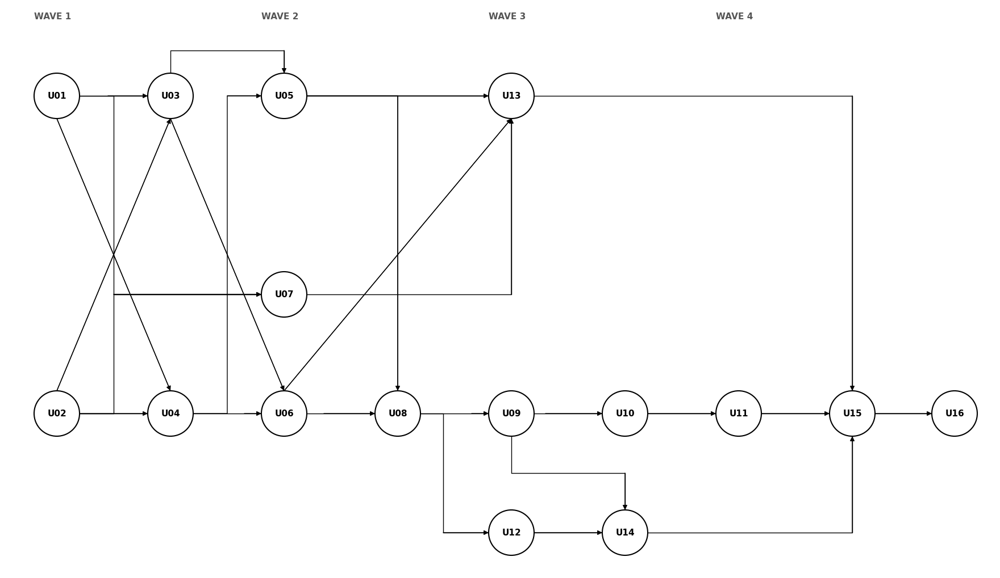

# Unit of Work Dependencies - 16 unit logic

## 1. Ký hiệu và nguyên tắc

Hàng là consumer, cột là provider. `H` cần behavior/contract ổn định trước integration gate; `C` phát triển song song qua contract có version và fake adapter; `E` tiêu thụ event/read model; `-` không phụ thuộc trực tiếp. Không ký hiệu nào cho phép đọc bảng hoặc repository của unit khác. Các unit vẫn thuộc một backend modular monolith; worker là process riêng.

## 2. Dependency matrix

| Consumer \ Provider | U01 | U02 | U03 | U04 | U05 | U06 | U07 | U08 | U09 | U10 | U11 | U12 | U13 | U14 | U15 | U16 |
|---|---:|---:|---:|---:|---:|---:|---:|---:|---:|---:|---:|---:|---:|---:|---:|---:|
| U01 | - | C | C | C | - | - | - | - | - | - | - | - | - | - | - | - |
| U02 | C | - | - | - | - | - | - | - | - | - | - | - | - | - | - | - |
| U03 | H | H | - | - | - | - | - | - | - | - | - | - | - | - | - | - |
| U04 | H | H | - | - | C | - | - | - | - | - | - | - | - | - | - | - |
| U05 | H | H | H | H | - | - | C | - | - | - | - | - | C | - | - | - |
| U06 | H | H | H | H | C | - | - | - | C | - | - | - | C | - | - | - |
| U07 | H | H | - | - | - | - | - | - | - | - | - | - | - | - | - | - |
| U08 | H | H | - | H | H | H | - | - | C | - | - | C | C | - | - | - |
| U09 | H | H | H | H | - | H | - | H | - | - | - | - | - | - | - | - |
| U10 | H | H | - | H | - | H | - | H | H | - | - | - | C | - | - | - |
| U11 | H | H | H | H | - | H | - | H | H | H | - | - | C | - | C | - |
| U12 | H | H | - | H | - | - | - | H | - | - | - | - | - | - | - | - |
| U13 | H | H | - | - | H | H | H | - | C | - | C | - | - | C | - | - |
| U14 | H | H | H | H | - | - | - | H | H | - | - | H | - | - | - | - |
| U15 | H | H | - | H | - | H | - | H | H | H | H | - | H | H | - | - |
| U16 | H | H | - | H | E | - | E | H | - | - | H | H | - | H | H | - |

### Dependency graph theo wave

Nguồn hình: `unit-of-work-dependency.drawio` (mở bằng draw.io để sửa). Hình vẽ các cạnh `H` tối giản theo bắc cầu; mọi mũi tên đi từ trái sang phải.

**Text alternative** (cạnh provider → consumer): U01 → U03, U04, U07; U02 → U03, U04, U07; U03 → U05, U06; U04 → U05, U06; U05 → U08, U13; U06 → U08, U13; U07 → U13; U08 → U09, U12; U09 → U10, U14; U10 → U11; U11 → U15; U12 → U14; U13 → U15; U14 → U15; U15 → U16 (đọc sổ điểm).

U01 phụ thuộc U02 (job OTP, audit), U03 (ảnh đại diện, `AvatarPort`) và U04 (phạm vi môn/lớp) bằng cạnh `C`: U01 khai báo port, các unit đó cung cấp implementation, nên U01 vẫn khởi động không cần chờ ai. U04 phụ thuộc U05 bằng cạnh `C`: phần Learning Access của U04 dùng port trung lập ở tầng contract, U05 cung cấp implementation, nên không tạo chu trình cứng với cạnh `H` theo chiều ngược lại. U05 phụ thuộc `CreditPort` của U07 bằng cạnh `C` để tính credit embedding; hai unit vẫn phát triển song song, nhưng adapter thật phải có trước khi bật Gemini cho U05. Mọi unit nghiệp vụ đều phụ thuộc `H` vào U01 để kiểm quyền actor/object và vào U02 để ghi audit append-only; các cạnh này không vẽ lại trong sơ đồ vì đã được phủ bắc cầu qua U03/U04/U05. Hình chỉ vẽ cạnh `H` tối giản theo bắc cầu (nếu A → B → C thì không lặp A → C); các cạnh `C` (U01 → U02, U02/U03/U04 → U01, U05 → U04, U07 → U05, U13 → U05, U05/U09/U13 → U06, U09/U12/U13 → U08, U13 → U10, U13/U15 → U11, U09/U11/U14 → U13) không vẽ, xem ma trận. U16 đọc sổ điểm của U15 qua port nên U15 → U16 là `H`; U16 còn phụ thuộc `H` vào U11/U14 (đọc tiến độ nộp bài) nhưng đã phủ bắc cầu qua U15. Các cạnh `E` U05/U07 → U16 (event lớp, event thanh toán) không vẽ. Ma trận phía trên vẫn là danh sách đầy đủ. Chiều mũi tên luôn từ provider sang consumer. Khung wave là nhóm và điểm dừng tích hợp, **không phải hàng rào đồng bộ**: node ở wave sau có thể mở khi provider trực tiếp của nó xong, dù node khác của wave trước vẫn chạy. Mọi mũi tên đi từ trái sang phải.

**Diễn giải bằng chữ:** Wave 1 có U01 và U02 khởi động song song; U03/U04 mở khi cả hai cung cấp contract/behavior cần thiết. Wave 2 có U05/U06 song song sau U04 và U07 mở ngay sau U01/U02; U08 theo U05/U06. Phần Learning Access của U04 hoàn tất tại wave này khi implementation của U05 cắm vào port trung lập. Wave 3 có U13 chạy khi nguồn U05/U06 và credit U07 sẵn sàng, trong khi U09/U12 theo U08; U10 theo U09 và U11 theo U04/U10. Wave 4 có U14 sau U09/U12, U15 sau U11/U13/U14 và U16 sau các event của owner. Các nhánh vượt ranh giới wave ngay khi dependency trực tiếp đạt; số unit đang triển khai đồng thời trên toàn nhóm không quá năm.

## 3. Public contract theo luồng

| Luồng | Provider → Consumer | Contract và giới hạn |
|---|---|---|
| Identity → audit/job query | U01 → U02 (`C`) | U02 ghi audit/điều phối job độc lập bằng actor/scope reference; `queryAudit` và `getJobStatus` gọi authorization contract có version, fail closed khi chưa tích hợp |
| Identity, audit, file, job | U01/U02/U03 → mọi unit cần dùng | Actor/resource authorization, append-only audit, scoped artifact, idempotent job; không dùng shared repository |
| Môn/lớp/ghi danh | U04 → U05, U06, U08-U12, U14-U16 (U01 đọc phạm vi qua `C`) | Subject/class/enrollment reference và scoped authorization |
| Learning access within U04 | U04 enrollment + U05 published content → Learning Access capability in U04 | Đây là orchestration nội bộ của U04, không phải self-dependency giữa unit; chỉ trả nội dung khi enrollment và publication hợp lệ; không lưu lesson progress |
| Ngân hàng → đề/attempt/chấm | U06 → U08/U09/U10/U11/U15 | QuestionVersion/RubricVersion immutable và snapshot đúng version |
| Tạo đề | U05/U06 → U13 → U08; U09/U10 cấu hình | U13 trả AI draft proposal; U08 review, sửa, lưu và publish. RAG chỉ hỗ trợ nguồn khi được chọn |
| Đề → attempt | U08/U09/U10 → U11 | Publication, schedule, simulation policy và assignment/question/rubric snapshot; bài đã phát hành khóa nội dung |
| Nhóm → tài liệu nhóm | U12 + U09 → U14 | Thành viên/trưởng nhóm, mô hình tài liệu; nhận/khóa mục, ghép realtime, bản nộp bất biến có tác giả từng mục |
| Chấm | U11/U14/U06 → U15; U13 hỗ trợ | AI chỉ trả proposal; U15 lưu manual/final grade; tài liệu nhóm chấm tay, AI chỉ đề xuất cho phần đóng góp của từng thành viên |
| Báo cáo/thông báo | U05 event lớp, owner events và điểm U15 → U16 | Thông báo trong app (SSE), email có trần 300/ngày, nhắc hạn, dashboard cá nhân và xuất bảng điểm; lỗi gửi không rollback transaction nguồn |

### Ranh giới tránh vòng phụ thuộc

- U13 định nghĩa provider-neutral `AiDraftProposal` và `CodeRunResult`; U08/U11/U15 chuyển yêu cầu đã kiểm quyền sang contract đó. U13 không đọc bảng Assessment/Submission/Grading và không publish/chốt thay owner.
- U02 không chờ U01 hoàn thiện để triển khai append-only audit, enqueue/lease/retry. Chỉ các read API có actor (`queryAudit`, `getJobStatus`) tích hợp `AuthorizationService` của U01 qua contract `C`; adapter thật là bắt buộc trước khi phát hành API và mặc định từ chối nếu không kiểm quyền được.
- U08 có thể hoàn thành luồng tạo đề thủ công trước khi U13 tích hợp AI. `C` ở U08 → U13 là contract tích hợp, không tạo hard cycle.
- U04 chỉ sở hữu kiểm quyền và truy cập học liệu. Dashboard frontend ghép dữ liệu từ API của U04, U08 và U16 khi các API có sẵn; U04 backend không phụ thuộc ngược U08/U16.
- U07 chỉ cộng credit AI sau thanh toán; không ảnh hưởng quyền vào lớp nên U04 không gọi U07. U07 không ghi enrollment vào U04.

## 4. Worker ownership

| Handler | Owner | Kết quả qua owner contract |
|---|---|---|
| File/YouTube ingestion và RAG index | U05 | Content/source/transcript version và index reference |
| AI assessment draft | U13 | Draft proposal cho U08 duyệt/lưu |
| Code sandbox run | U13 | Run result bất biến cho U11, U15 (chấm Code Lab) và U08 (kiểm lời giải mẫu) |
| Group document | U14 | Tài liệu nhóm, lịch sử mục theo tác giả, bản nộp bất biến |
| AI grade proposal và compact Draw.io | U13 phối hợp U15 | Proposal (XML rút gọn tạo trong bộ nhớ bởi U09); U15 quyết định điểm |
| Automatic payment reconciliation | U07 | Giao dịch PayOS, ví và sổ cái credit AI |
| Notification & reporting | U16 | Thông báo, email outbox, nhắc hạn, dashboard đọc theo yêu cầu và xuất bảng điểm trực tiếp |

Job Platform U02 giữ lease/retry/status (không có dead-letter; hết lượt thì `FAILED`), còn owner nghiệp vụ kiểm tra idempotency và lưu kết quả. Worker payload chỉ chứa ID/reference và scope; worker tải nguồn qua contract có quyền.

## 5. Bốn wave với lịch mở việc liên tục

| Wave | Unit | Số unit | Nhánh và điều kiện mở |
|---|---|---:|---|
| 1 | U01, U02, U03, U04 | 4 | U01 và U02 song song (`C` hai chiều: U02 dùng quyền của U01 cho read API, U01 dùng job/audit của U02); U03/U04 sau U01 và U02; phần Learning Access của U04 chỉ khai báo port, hoàn tất ở wave 2 |
| 2 | U05, U06, U07, U08 | 4 | U05/U06 sau U04; U07 sau U01/U02; U08 sau U05/U06; U05 cắm implementation vào port Learning Access của U04 |
| 3 | U09, U10, U11, U12, U13 | 5 | U09/U12 sau U08; U10 sau U09; U11 sau U04/U10; U13 sau U05/U06/U07 |
| 4 | U14, U15, U16 | 3 | U14 sau U09/U12; U15 sau U11/U13/U14; U16 sau U15 (đọc sổ điểm) |

Wave biểu thị nhóm và checkpoint kết quả, không buộc toàn bộ unit của wave trước đóng mới cho mở unit tiếp theo. Scheduler mở unit khi các provider `H` của riêng unit đã sẵn sàng và còn slot; giới hạn tối đa năm unit đang triển khai cùng lúc tính trên toàn bộ wave. U08 có thể làm phần thủ công trước U13; AI tích hợp sau qua contract `C`. U16 có thể chuẩn bị schema/projection từ đầu, nhưng chỉ hoàn tất khi event từ các owner, gồm U15, đã có.

| Gate | Producer cần ổn định | Kiểm tra theo nhánh |
|---|---|---|
| G1 | U01-U04 | Authorization, audit/job, artifact/checksum và class/enrollment scope |
| G2 | U05-U08 và phần Learning Access của U04 | Content/bank versions, verified payment event, Learning access và đề thủ công/publication |
| G3 | U09-U13 | Question type/tài liệu, template/copy/simulation, bộ nhóm, AI/Code và attempt/submission |
| G4 | U14-U16 | Tài liệu nhóm realtime/nộp, final grade, reporting/notification đúng scope |

Gate tổng kiểm tra toàn bộ phạm vi của wave; nhánh ở wave sau được mở ngay khi provider trực tiếp đạt kiểm tra tương ứng, không phải chờ gate tổng.

## 6. Dependency paths và critical path

- **Truy cập học liệu:** U01 và U02 song song → U04 → U05 → U04. U04 kiểm enrollment và publication; không có learning path hay lesson progress.
- **Bài cá nhân:** U01/U02 → U04/U06 → U08 → U09 → U10 → U11 → U15 → U16. U03 cung cấp artifact; U13 cung cấp AI draft/Code run khi được chọn.
- **Bài nhóm:** U08 → U12, đồng thời U08/U09/U10 → U11; U09 + U12 → U14 → U15 → U16.
- **AI tạo đề:** U05/U06 → U13 → U08 (contract `C`); U08 có thể soạn thủ công trước khi AI hoàn tất. **AI hỗ trợ chấm:** U11/U14 → U15 gọi U13, rồi giảng viên chốt.
- **Một đường phụ thuộc dài nhất theo các cạnh `H`:** U01 hoặc U02 → U03 → U05 → U08 → U09 → U10 → U11 → U15 → U16 (9 unit). Nhánh U01 hoặc U02 → U04 → U06 → U08 cũng hội vào đường này ở U08. U16 đọc sổ điểm của U15 qua cạnh `H` và nhận event của U05/U07/U15; thêm người không làm các cạnh bắt buộc biến mất.

| Rủi ro | Kiểm soát |
|---|---|
| 16 unit bị hiểu thành 16 deployable/service | Một backend modular monolith; unit chỉ là boundary phát triển và kiểm thử |
| Contract AI tạo vòng phụ thuộc | U13 trả proposal chung; owner U08/U15 lưu kết quả, không cho U13 ghi ngược |
| Phần Learning Access của U04 bị phình thành learning path/progress | Chỉ kiểm quyền, trả nội dung/dashboard shell; không có state hoàn thành bài học |
| Cross-unit data leak | Actor/resource scope ở U01, gọi public contract, negative authorization tests |
| Job/provider lỗi hoặc giao trùng | U02 retry/idempotency; owner xử lý kết quả và safe failure |
