# AI-DLC Execution Plan

## 1. Detailed Analysis Summary

### Project and scope

- **Project type**: Greenfield.
- **Primary goal**: Xây dựng MVP web AI-Powered Learning Platform cho một tổ chức, đồng thời duy trì đầy đủ artifact/checkpoint AI-DLC.
- **Business scope**: Bốn vai trò (không có Head of Department), quản lý môn/lớp/nhóm/nội dung, bài nhóm hai cấp, RAG và tạo bài bằng AI, rubric/câu hỏi, bốn loại bài đánh giá, học tập/tiến độ, đánh giá/chấm điểm, giám sát AI, thanh toán, thông báo và audit.
- **Technical direction already fixed**: Next.js/TypeScript frontend, Java/Spring Boot backend, local container; provider/database/cloud cụ thể chưa được chọn.
- **Brownfield transformation**: N/A; workspace không có application code nên Reverse Engineering và package-change analysis được bỏ qua.

### Change Impact Assessment

| Khu vực | Tác động | Nhận định |
|---|---|---|
| User-facing | Có - toàn hệ thống | 55 stories trên bốn persona và mười một miền nghiệp vụ sản phẩm |
| Structural | Có - lớn | Cần xác định component/service boundary, async work và external adapters |
| Data model | Có - lớn | User/role/scope môn, môn/lớp/nhóm/leader, phần cá nhân/bài chung, nội dung, tiến độ, assessment, submission, grade, payment, notification, audit |
| API/contracts | Có - lớn | Web API, upload/status, AI task, payment webhook và provider adapters |
| NFR | Có - lớn | Security/Resiliency Baseline, p95, async processing, accessibility, observability, backup và multi-zone production |
| Infrastructure | Có | Local container và thiết kế production single-region/multi-zone |
| Operations | Có giới hạn | CI/CD, rollback, health, logs/metrics/traces, incident/DR artifacts; Operations stage vẫn là placeholder |

### Risk Assessment

- **Risk level**: High.
- **Business criticality**: Medium theo Requirements; dùng thử với người thật và có phương án xử lý thủ công khi gián đoạn.
- **Nguồn rủi ro chính**: Authorization bốn vai trò có scope môn/lớp, dữ liệu/điểm người học, file/RAG, AI không quyết định điểm cuối, webhook payment idempotent và dependency failure.
- **Rollback complexity**: Moderate cho application image; Difficult nếu schema migration phá vỡ, vì vậy migration phải backward-compatible hoặc có recovery plan riêng.
- **Testing complexity**: Complex; cần unit, integration, contract/webhook, system và e2e trong môi trường container.
- **Giảm thiểu**: Phân rã units trước khi code, design gate theo unit, TDD trong Code Generation, system test toàn stack và kiểm tra Security/Resiliency ở từng stage.

## 2. Workflow Visualization

```mermaid
flowchart TD
    Start(["User Request"])
    subgraph INCEPTION["INCEPTION PHASE"]
        WD["Workspace Detection<br/><b>COMPLETED</b>"]
        RE["Reverse Engineering<br/><b>SKIP</b>"]
        RA["Requirements Analysis<br/><b>COMPLETED</b>"]
        US["User Stories<br/><b>APPROVED</b>"]
        WP["Workflow Planning<br/><b>COMPLETED</b>"]
        AD["Application Design<br/><b>EXECUTE</b>"]
        UG["Units Generation<br/><b>EXECUTE</b>"]
    end
    subgraph CONSTRUCTION["CONSTRUCTION PHASE"]
        FD["Functional Design<br/><b>EXECUTE PER UNIT</b>"]
        NFRA["NFR Requirements<br/><b>EXECUTE PER UNIT</b>"]
        NFRD["NFR Design<br/><b>EXECUTE PER UNIT</b>"]
        ID["Infrastructure Design<br/><b>EXECUTE PER UNIT</b>"]
        CG["Code Generation<br/><b>EXECUTE PER UNIT</b>"]
        BT["Build and Test<br/><b>EXECUTE</b>"]
    end
    subgraph OPERATIONS["OPERATIONS PHASE"]
        OPS["Operations<br/><b>PLACEHOLDER</b>"]
    end
    Start --> WD
    WD --> RE
    RE --> RA
    RA --> US
    US --> WP
    WP --> AD
    AD --> UG
    UG --> FD
    FD --> NFRA
    NFRA --> NFRD
    NFRD --> ID
    ID --> CG
    CG --> BT
    BT -.-> OPS
    BT --> End(["Workflow Complete"])

    style WD fill:#4CAF50,stroke:#1B5E20,stroke-width:3px,color:#fff
    style RE fill:#BDBDBD,stroke:#424242,stroke-width:2px,stroke-dasharray:5 5,color:#000
    style RA fill:#4CAF50,stroke:#1B5E20,stroke-width:3px,color:#fff
    style US fill:#4CAF50,stroke:#1B5E20,stroke-width:3px,color:#fff
    style WP fill:#4CAF50,stroke:#1B5E20,stroke-width:3px,color:#fff
    style AD fill:#FFA726,stroke:#E65100,stroke-width:3px,stroke-dasharray:5 5,color:#000
    style UG fill:#FFA726,stroke:#E65100,stroke-width:3px,stroke-dasharray:5 5,color:#000
    style FD fill:#FFA726,stroke:#E65100,stroke-width:3px,stroke-dasharray:5 5,color:#000
    style NFRA fill:#FFA726,stroke:#E65100,stroke-width:3px,stroke-dasharray:5 5,color:#000
    style NFRD fill:#FFA726,stroke:#E65100,stroke-width:3px,stroke-dasharray:5 5,color:#000
    style ID fill:#FFA726,stroke:#E65100,stroke-width:3px,stroke-dasharray:5 5,color:#000
    style CG fill:#4CAF50,stroke:#1B5E20,stroke-width:3px,color:#fff
    style BT fill:#4CAF50,stroke:#1B5E20,stroke-width:3px,color:#fff
    style OPS fill:#BDBDBD,stroke:#424242,stroke-width:2px,stroke-dasharray:5 5,color:#000
    style INCEPTION fill:#BBDEFB,stroke:#1565C0,stroke-width:3px,color:#000
    style CONSTRUCTION fill:#C8E6C9,stroke:#2E7D32,stroke-width:3px,color:#000
    style OPERATIONS fill:#FFF59D,stroke:#F57F17,stroke-width:3px,color:#000
    style Start fill:#CE93D8,stroke:#6A1B9A,stroke-width:3px,color:#000
    style End fill:#CE93D8,stroke:#6A1B9A,stroke-width:3px,color:#000
    linkStyle default stroke:#333,stroke-width:2px
```

### Text alternative

1. Workspace Detection - completed.
2. Reverse Engineering - skipped because the workspace is greenfield.
3. Requirements Analysis - completed.
4. User Stories - approved.
5. Workflow Planning - completed after revalidation.
6. Application Design - execute.
7. Units Generation - execute.
8. For every generated unit: Functional Design, NFR Requirements, NFR Design, Infrastructure Design and Code Generation - execute in that order.
9. After all units: Build and Test - execute.
10. Operations - placeholder only.

## 3. Stage Decisions

### INCEPTION PHASE

- [x] **Workspace Detection - COMPLETED**: Greenfield workspace confirmed.
- [x] **Reverse Engineering - SKIPPED**: Không có application code hoặc kiến trúc hiện hữu để reverse engineer.
- [x] **Requirements Analysis - COMPLETED**: Comprehensive requirements đã được duyệt và bổ sung vai trò Chủ nhiệm môn.
- [x] **User Stories - APPROVED**: Bốn persona, 55 stories và use case specification đã được duyệt.
- [x] **Workflow Planning - COMPLETED**: Kế hoạch được revalidate sau khi User Stories/Use Case được duyệt; Application Design là stage kế tiếp.
- [ ] **Application Design - EXECUTE**: Cần xác định component/service boundaries, trách nhiệm, methods, dependency và luồng đồng bộ/bất đồng bộ cho một hệ thống mới.
- [ ] **Units Generation - EXECUTE**: Hệ thống có nhiều domain, data model, API, external adapters và infrastructure concerns; cần phân rã thành units độc lập, có dependency order rõ.

### CONSTRUCTION PHASE - per-unit loop

- [ ] **Functional Design - EXECUTE PER UNIT**: Cần thiết cho authorization scope, subject/class inheritance, assessment lifecycle, grading, payment entitlement và audit rules.
- [ ] **NFR Requirements - EXECUTE PER UNIT**: Cần tinh chỉnh tech stack, performance, security, accessibility, testing và provider constraints theo từng unit.
- [ ] **NFR Design - EXECUTE PER UNIT**: Cần thiết kế timeout/retry/circuit breaker, async jobs, observability, security controls và resiliency patterns.
- [ ] **Infrastructure Design - EXECUTE PER UNIT**: Cần ánh xạ local containers và production single-region/multi-zone, storage, database, networking, secret, backup và scaling.
- [ ] **Code Generation - EXECUTE PER UNIT (ALWAYS)**: Mỗi unit phải có code-generation plan được duyệt, TDD, implementation và verification riêng.

### CONSTRUCTION PHASE - after all units

- [ ] **Build and Test - EXECUTE (ALWAYS)**: Tổng hợp build instructions và chạy unit, integration, contract/webhook, system và e2e tests trên full stack container.

### OPERATIONS PHASE

- [ ] **Operations - PLACEHOLDER**: Không thực thi automation ngoài phạm vi hiện tại; các yêu cầu sẵn sàng vận hành vẫn được thiết kế và kiểm thử trong Construction.

## 4. Sequencing and Coordination

### Nguyên tắc phân rã

Units Generation sẽ chốt tên và ranh giới units. Không khóa sớm cấu trúc package hoặc provider trong Workflow Planning. Phân rã phải tạo các lát cắt có thể thiết kế, code và test độc lập, đồng thời bao phủ:

- Identity/authorization và academic scope.
- Subject/class content và private file/RAG ingestion.
- Group/leader management, individual work packages và leader-only shared DOCX submission.
- Learning progress.
- AI authoring và assessment delivery.
- Submission, grading và gradebook.
- Payment/entitlement.
- Notification và audit.
- Platform/infrastructure concerns dùng chung.

### Trình tự phụ thuộc sơ bộ

1. Xác định application boundaries và contracts ở Application Design.
2. Units Generation lập unit-story map và dependency graph.
3. Ưu tiên các unit nền tảng về identity, authorization, academic model và shared contracts trước các unit phụ thuộc.
4. Hoàn thiện từng unit theo vòng Functional Design → NFR Requirements → NFR Design → Infrastructure Design → Code Generation.
5. External adapter phải có sandbox/mock contract trước khi hành trình phụ thuộc được coi là hoàn tất.
6. Sau tất cả units, thực hiện Build and Test toàn hệ thống.

### Coordination gates

- API/schema changes phải có contract và migration compatibility trước khi unit phụ thuộc triển khai.
- Subject-level authorization phải được dùng nhất quán bởi content, AI và assessment units.
- Payment entitlement phải idempotent trước khi nối vào access control.
- Shared audit/event conventions phải ổn định trước khi các unit nghiệp vụ hoàn tất.
- Mỗi unit chỉ được chuyển tiếp sau approval checkpoint bắt buộc của stage hiện tại.

## 5. Testing Strategy

- **Unit tests**: Business rules, authorization decisions, state transitions, grading calculations và idempotency.
- **Integration tests**: Database, object storage abstraction, async jobs, provider adapters và security filters.
- **Contract tests**: AI/email/storage adapter contracts và payment webhook signature/idempotency.
- **System tests**: Next.js + Spring Boot + database + mock/sandbox AI/payment chạy trong container.
- **End-to-end tests**: Giảng viên tạo/giao bài; chia nhóm/chỉ định leader; thành viên nộp phần cá nhân; leader nộp DOCX chung; giảng viên đối chiếu/chấm tay; Chủ nhiệm môn phát hành đề chung; người học học/nộp/xem kết quả; payment cấp quyền; authorization misuse cases.
- **Non-functional tests**: p95 API target, upload limits, accessibility core flows, failure/degraded behavior, backup/restore instructions và security checks.

## 6. Success Criteria and Quality Gates

### Primary success

MVP thực hiện được các hành trình MVP trong Requirements và bộ 55 stories phân tách MVP/Phase 2 với đúng bốn vai trò, chạy local bằng container và có bộ test tự động tái tạo được.

### Key deliverables

- Application Design và component diagram.
- Unit decomposition, dependency map và story mapping.
- Per-unit functional/NFR/infrastructure design artifacts.
- Next.js frontend, Spring Boot backend, persistence, external adapters và container setup tại workspace root.
- Build/test instructions và kết quả verification trong `aidlc-docs/construction/build-and-test/`.
- State/audit/checkpoint AI-DLC luôn được cập nhật.

### Quality gates

- Không stage nào vượt approval gate bắt buộc.
- Không plan step nào hoàn tất mà checkbox chưa được cập nhật cùng lượt.
- Không code trước code-generation plan approval của unit tương ứng.
- Tất cả FR và stories có implementation/test traceability.
- Không có blocking Security hoặc Resiliency finding ở stage completion.
- Không secret trong repository; dependency/image được pin; production error không lộ nội bộ.
- Payment webhook signature/idempotency, object/function authorization và AI scope isolation phải có negative tests.
- System/e2e test cốt lõi phải chạy trên môi trường container trước khi Build and Test được duyệt.

## 7. Estimated Effort Boundary

- **Stage types còn phải thực thi**: 8 loại - Application Design, Units Generation, năm stage per-unit và Build and Test.
- **Số vòng per-unit**: Được xác định tại Units Generation; không ước đoán trước khi có dependency map.
- **Thời lượng lịch**: Chưa cam kết vì chưa có quy mô đội ngũ, năng lực triển khai hoặc provider choices; kế hoạch đo theo approval gates và deliverable thay vì ngày giả định.

## 8. Extension Compliance tại Workflow Planning

### Security Baseline

| Nhóm rule | Trạng thái | Xử lý trong kế hoạch |
|---|---|---|
| SECURITY-01 đến SECURITY-05 | Compliant | Data protection, logging, headers, validation được đưa vào NFR/design/code/test gates |
| SECURITY-06 đến SECURITY-09 | Compliant | IAM/network least privilege, authorization và hardening bắt buộc trong design/infrastructure/code |
| SECURITY-10 đến SECURITY-13 | Compliant | Dependency/artifact integrity, abuse controls, auth/session và payment integrity có downstream gates |
| SECURITY-14 đến SECURITY-15 | Compliant | Alerting/audit và fail-safe behavior được giữ xuyên design, code và test |

Không có blocking security finding tại Workflow Planning.

### Resiliency Baseline

| Nhóm rule | Trạng thái | Xử lý trong kế hoạch |
|---|---|---|
| RESILIENCY-01 đến RESILIENCY-04 | Compliant | Impact, RTO/RPO, change, CI/CD/rollback được chuyển rõ tới Application/NFR/Infrastructure Design |
| RESILIENCY-05 đến RESILIENCY-10 | Compliant | Observability, health, alarms, multi-zone, capacity và dependency isolation có stage thực thi bắt buộc |
| RESILIENCY-11 đến RESILIENCY-15 | Compliant | DR, backup, recovery test gate và incident/COE được giữ cho design/build-test; RESILIENCY-14 phải hỏi tại NFR Design |

Không có blocking resiliency finding tại Workflow Planning. Property-Based Testing đã bị tắt và được ghi N/A.

## 9. User Control

Người dùng có thể yêu cầu thêm, bỏ hoặc thay đổi độ sâu của bất kỳ conditional stage nào trước khi duyệt kế hoạch. Nếu thay đổi làm ảnh hưởng requirements hoặc stories, artifact nguồn phải được cập nhật và duyệt lại trước khi tiếp tục.
