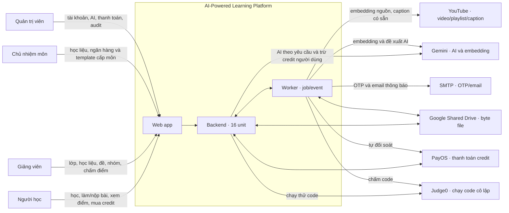

# Context diagram — AI-Powered Learning Platform

Sơ đồ ngữ cảnh cho **một MVP**. Người dùng truy cập giao diện web; backend và worker là các tiến trình của cùng ứng dụng. Mũi tên chỉ trao đổi dữ liệu, không hàm ý nhà cung cấp được quyền tự quyết định điểm hoặc phát hành nội dung.

**Diễn giải bằng chữ:** Người học, giảng viên, Chủ nhiệm môn và quản trị viên dùng web app. Backend kiểm quyền, giữ trạng thái nghiệp vụ và gọi worker cho tác vụ nền. Google Drive giữ byte file; PayOS xử lý chuyển khoản và gửi webhook để backend xác minh trước khi cộng credit; Gemini tạo embedding/bản nháp/đề xuất chấm; YouTube cung cấp video và caption sẵn có; Judge0 chạy mã cô lập; SMTP gửi OTP và email. Giảng viên quyết định điểm cuối. Khi quota AI hệ thống hết, ứng dụng báo “Hệ thống đang bận”; thiếu credit cá nhân là lỗi riêng.

## Ranh giới nội bộ

| Thành phần | Trách nhiệm |
|---|---|
| PostgreSQL + pgvector | Bảng nghiệp vụ theo unit và vector RAG của U05 |
| Redis | OTP, phiên, rate limit, trần AI/email và token tải tạm thời |
| RabbitMQ | Chuyển job, event và tín hiệu realtime; U02 giữ trạng thái job/audit trong PostgreSQL |
| Worker | Ingest học liệu, gửi mail, tự đối soát, chạy AI/code, tự nộp và nhắc hạn |

Nguồn: [hạ tầng chung](../aidlc-docs/construction/shared-infrastructure.md), [phụ thuộc unit](../aidlc-docs/inception/application-design/unit-of-work-dependency.md) và các file `infrastructure-design.md` của U01–U16.
