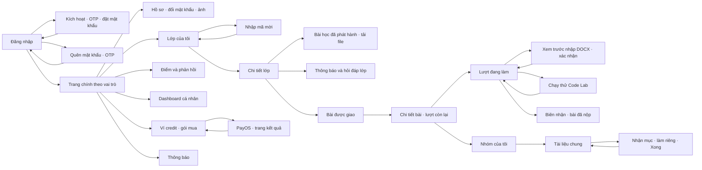
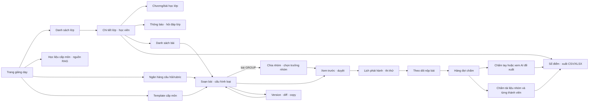
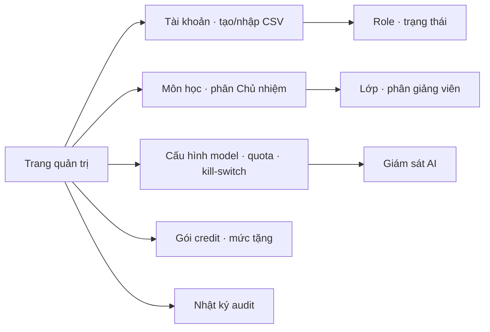

# Screen flow — các màn hình MVP

Mũi tên là điều hướng chính; nhánh trong ngoặc là thao tác/dialog trên cùng trang. Tên route ở đây là định hướng từ `frontend-components.md`; API/URL cuối cùng được chốt khi triển khai. Tất cả màn hình đều phải kiểm quyền ở backend.

## 1. Truy cập chung và người học

**Diễn giải bằng chữ:** Người học đăng nhập hoặc kích hoạt/khôi phục tài khoản, vào các lớp đã ghi danh, xem bài học và hỏi đáp, mở bài được giao rồi bắt đầu một lượt. Bài DOCUMENT cho phép xem trước DOCX và thêm block vào lượt đang làm; Code Lab cho chạy thử. Bài nhóm mở tài liệu chung, thành viên nhận mục và bấm “Xong”; trưởng nhóm nộp. Người học xem điểm đã công bố, dashboard, ví credit và thông báo.

## 2. Giảng viên và Chủ nhiệm môn

**Diễn giải bằng chữ:** Giảng viên quản lý lớp, nội dung và bài giao; soạn một trong năm loại bài, cấu hình nhóm nếu là GROUP, duyệt rồi phát hành. Sau khi có bài nộp, giảng viên theo dõi tiến độ, chấm tay hoặc yêu cầu AI đề xuất cho bài/phần được phép, chốt và công bố điểm, rồi xem/xuất sổ điểm. Chủ nhiệm môn có thêm học liệu RAG, ngân hàng và template cấp môn; template phải được copy về lớp trước khi dùng. Bài đã phát hành bị khóa nội dung; khi mọi lần giao của version đã đóng/ngưng, nút sửa tạo version mới.

## 3. Quản trị viên

**Diễn giải bằng chữ:** Quản trị viên tạo/nhập tài khoản, phân công môn/lớp, cấu hình và giám sát AI, quản lý gói credit, xem audit. Không có màn hình hoàn tiền trong MVP hiện tại vì chính sách chưa chốt.

## Điểm điều hướng và quyền cần giữ

| Màn hình/luồng | Quy tắc |
|---|---|
| Bài học và file lớp | Chỉ học viên ghi danh còn hiệu lực hoặc người quản lý có quyền; U04 kiểm quyền, U05 trả nội dung, U03 cấp token tải |
| DOCX của người học | Chỉ trên lượt DOCUMENT đang `IN_PROGRESS`; xem trước rồi xác nhận, không ghi đè block khung giảng viên |
| Thi thử | Hiện số lượt còn lại, cách lấy kết quả `HIGHEST/LATEST/AVERAGE` và có/không tính điểm |
| AI hỗ trợ chấm | Giảng viên chủ động yêu cầu; UI hiển thị đề xuất riêng với điểm cuối; giảng viên chấp nhận hoặc ghi đè |
| Hết quota AI / thiếu credit | Hai trạng thái lỗi riêng: “Hệ thống đang bận” / “Không đủ credit AI” |
| Sổ điểm | Điểm từng bài, không có điểm tổng/hệ số; người học chỉ thấy điểm của mình đã công bố |

Nguồn: các file `functional-design/frontend-components.md` của [U01–U16](../aidlc-docs/construction/) và [quy tắc nghiệp vụ](../aidlc-docs/inception/requirements/requirements.md).
