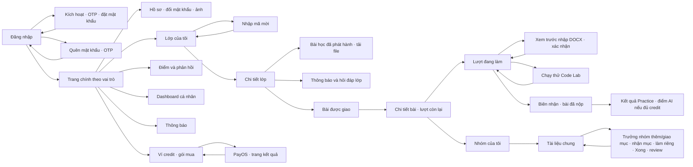
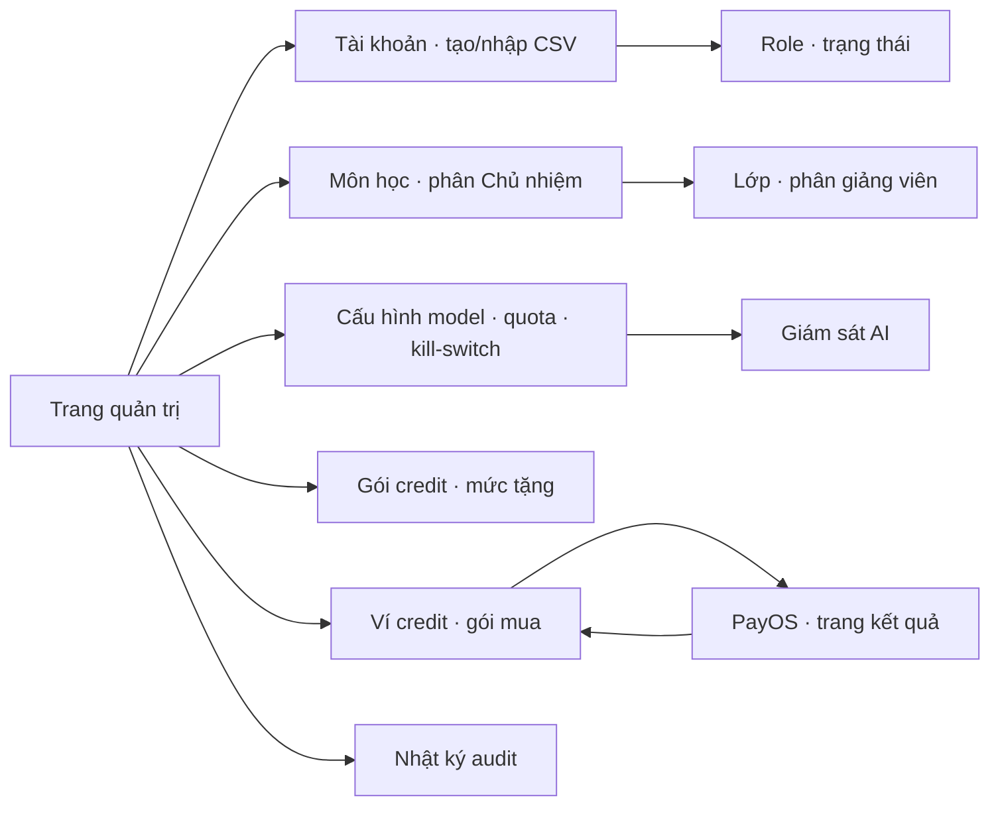

# Screen flow — các màn hình MVP

Bản vẽ đầy đủ nằm ở [screen-flow.drawio](screen-flow.drawio): Sign In ở giữa, nhánh tỏa ra theo menu từng vai trò; hình chữ nhật là màn hình, hình elip là popup ghi dữ liệu hoặc tải file, khung trắng có ô con là trang có tab, ô bo tròn viền đậm là menu của vai trò; ô xám nét đứt là hệ thống ngoài (PayOS).

Mũi tên là điều hướng chính; nhánh trong ngoặc là thao tác/dialog trên cùng trang. Tên route ở đây là định hướng từ `frontend-components.md`; API/URL cuối cùng được chốt khi triển khai. Tất cả màn hình đều phải kiểm quyền ở backend.

## 1. Truy cập chung và sinh viên

```mermaid
flowchart LR
    login["Đăng nhập"]
    activate["Kích hoạt · OTP · đặt mật khẩu"]
    reset["Quên mật khẩu · OTP"]
    shell["Trang chính theo vai trò"]
    profile["Hồ sơ · đổi mật khẩu · ảnh"]
    classes["Lớp của tôi"]
    join["Nhập mã mời"]
    classPage["Chi tiết lớp"]
    lesson["Bài học đã phát hành · tải file"]
    discussion["Thông báo và hỏi đáp lớp"]
    assignments["Bài được giao"]
    overview["Chi tiết bài · lượt còn lại"]
    attempt["Lượt đang làm"]
    docx["Xem trước nhập DOCX · xác nhận"]
    code["Chạy thử Code Lab"]
    receipt["Biên nhận · bài đã nộp"]
    practice["Kết quả Practice · điểm AI nếu đủ credit"]
    group["Nhóm của tôi"]
    groupDoc["Tài liệu chung"]
    section["Trưởng nhóm thêm/giao mục · nhận mục · làm riêng · Xong · review"]
    grades["Điểm và phản hồi"]
    dashboard["Dashboard cá nhân"]
    notifications["Thông báo"]
    credits["Ví credit · gói mua"]
    payment["PayOS · trang kết quả"]
    login --> shell
    login --> activate --> login
    login --> reset --> login
    shell --> profile
    shell --> classes
    classes --> join --> classes
    classes --> classPage
    classPage --> lesson
    classPage --> discussion
    classPage --> assignments --> overview --> attempt --> receipt
    attempt --> docx --> attempt
    attempt --> code --> attempt
    receipt --> practice
    overview --> group --> groupDoc --> section --> groupDoc
    shell --> grades
    shell --> dashboard
    shell --> notifications
    shell --> credits --> payment --> credits
```

**Diễn giải bằng chữ:** Sinh viên đăng nhập hoặc kích hoạt/khôi phục tài khoản (UC 1–6), vào các lớp đã ghi danh hoặc nhập mã mời (UC 10, UC 19), xem bài học và hỏi đáp (UC 12–14), mở bài được giao rồi bắt đầu một lượt (UC 29–31). Bài Diagram Essay cho phép xem trước DOCX và thêm block vào lượt đang làm; Code Lab cho chạy thử bằng Judge0, không dùng AI. Bài `PRACTICE` Text/Diagram Essay hiện điểm và phản hồi AI trong lượt đã nộp nếu sinh viên đủ credit khi nộp (UC 40). Bài nhóm mở tài liệu chung: trưởng nhóm thêm/sửa mục chi tiết dưới mục chính và giao cho thành viên, thành viên nhận hoặc làm mục được giao rồi bấm “Xong”; khi mọi mục xong, tài liệu vào review để cả nhóm xem lại, sau đó trưởng nhóm nộp (UC 15, UC 16). Sinh viên xem điểm đã công bố, dashboard và thông báo (UC 18, UC 35, UC 38), và có thể mua credit AI chỉ để dùng cho bài `PRACTICE` (UC 37).

## 2. Giảng viên và Chủ nhiệm môn

```mermaid
flowchart LR
    home["Trang giảng dạy"]
    classList["Danh sách lớp"]
    classDetail["Chi tiết lớp · học viên"]
    content["Chương/bài học lớp"]
    subjectContent["Học liệu cấp môn · nguồn RAG"]
    communication["Thông báo · hỏi đáp lớp"]
    bank["Ngân hàng câu hỏi/rubric"]
    templates["Template cấp môn"]
    assignmentList["Danh sách bài"]
    editor["Soạn bài · cấu hình loại"]
    groupSet["Sinh viên và nhóm · chia ngẫu nhiên · trưởng nhóm"]
    review["Xem trước · duyệt"]
    publish["Lịch phát hành · chế độ bài"]
    progress["Theo dõi nộp bài"]
    gradingQueue["Hàng đợi chấm"]
    grading["Chấm tay hoặc xem AI đề xuất"]
    groupGrading["Chấm tài liệu nhóm và từng thành viên"]
    gradebook["Sổ điểm · xuất CSV/XLSX"]
    version["Version · diff · copy"]
    credits["Ví credit · gói mua"]
    payment["PayOS · trang kết quả"]
    home --> classList --> classDetail
    classDetail --> content
    classDetail --> communication
    classDetail --> groupSet
    classDetail --> assignmentList --> editor
    home --> subjectContent
    home --> bank
    home --> templates --> editor
    bank --> editor
    editor --> review --> publish --> progress --> gradingQueue
    editor --> version --> editor
    gradingQueue --> grading --> gradebook
    gradingQueue --> groupGrading --> gradebook
    classDetail --> gradebook
    home --> credits --> payment --> credits
```

**Diễn giải bằng chữ:** Giảng viên quản lý lớp, chia nhóm ngay trong danh sách sinh viên của lớp (tạo tay hoặc chia ngẫu nhiên), nội dung và bài giao (UC 9, UC 11, UC 13); soạn một trong bốn loại bài cá nhân (UC 24–27) hoặc bài nhóm Group Assignment kèm các mục chính (UC 28), duyệt rồi phát hành (UC 28); có thể nhờ AI soạn đề từ nội dung lớp (UC 21). Sau khi có bài nộp `GRADED`, giảng viên theo dõi tiến độ, chấm tay hoặc yêu cầu AI đề xuất cho bài/phần được phép, chốt và công bố điểm, rồi xem/xuất sổ điểm và bật phân bố điểm ẩn danh cho sinh viên (UC 17, UC 32–34, UC 36). Bài `PRACTICE` không vào hàng đợi chấm. Chủ nhiệm môn có thêm học liệu RAG, rubric/câu hỏi quiz và template cấp môn, có thể nhờ AI tạo template từ RAG cấp môn (UC 11, UC 20, UC 22, UC 25, UC 28); template phải được copy về lớp trước khi dùng. Cả hai vai trò được mua credit AI cho tài khoản của mình (UC 37). Bài đã phát hành bị khóa nội dung; khi mọi lần giao của version đã đóng/ngưng, nút sửa tạo version mới.

## 3. Quản trị viên

```mermaid
flowchart LR
    admin["Trang quản trị"]
    accounts["Tài khoản · tạo/nhập CSV"]
    accountDetail["Role · trạng thái"]
    subjects["Môn học · phân Chủ nhiệm"]
    classes["Lớp · phân giảng viên"]
    ai["Cấu hình model · quota · kill-switch"]
    usage["Giám sát AI"]
    packages["Gói credit · mức tặng"]
    credits["Ví credit · gói mua"]
    payment["PayOS · trang kết quả"]
    audit["Nhật ký audit"]
    admin --> accounts --> accountDetail
    admin --> subjects --> classes
    admin --> ai --> usage
    admin --> packages
    admin --> credits --> payment --> credits
    admin --> audit
```

**Diễn giải bằng chữ:** Quản trị viên tạo/nhập tài khoản (UC 7), phân công môn/lớp (UC 8, UC 9), cấu hình và giám sát AI, quản lý gói credit và mức tặng hằng tháng (UC 23), có thể mua credit cho tài khoản của mình (UC 37) và xem audit (UC 39). Không có màn hình hoàn tiền trong MVP hiện tại vì chính sách chưa chốt.

## Màn hình theo unit và UC

Bảng dưới liệt kê mọi ô trong [screen-flow.drawio](screen-flow.drawio) (57 màn hình, 15 tab, 80 popup), unit sẽ xây và UC mà ô đó phục vụ. Sơ đồ chỉ ghi tên ô; unit và UC tra ở bảng này. Mã UC theo [bảng use case hiện hành](use-case-table.md); unit theo [story map](../aidlc-docs/inception/application-design/unit-of-work-story-map.md).

- **Không có dashboard chung.** Đăng nhập xong U01 điều hướng theo role tới trang đích riêng (ghi `landing`): sinh viên → Student Dashboard, giảng viên và Chủ nhiệm môn → My Teaching Classes, quản trị viên → Account List. Ô bo tròn viền đậm (màu theo vai trò) là menu điều hướng, không phải màn hình.
- Chủ nhiệm môn thấy cả Teacher Menu (cùng link `/teaching`) và thêm Subject Manager Menu; trang cùng link chỉ vẽ một lần.
- Chỉ giữ popup **tạo, sửa hoặc xóa dữ liệu trong PostgreSQL** hoặc **tải file từ hệ thống**. Đã bỏ các popup/drawer chỉ đọc: xem trước bài/câu hỏi, lịch sử điểm, chi tiết audit, lịch sử version ngân hàng; bỏ panel Draw.io và nút đánh dấu mục việc (ghi cùng lúc lưu khung ở tab Type Config); bỏ Sign Out vì chỉ xóa phiên trong Redis (nút nằm ở trang Profile).
- Ô có nhiều unit: unit đầu dựng trang, unit sau cung cấp component nhúng (ví dụ `AiDraftDialog` của U13 trong trình soạn U08).
- Danh mục hiện hành có 40 UC, đánh số 1–40 theo [bảng use case](use-case-table.md); đủ 16/16 unit có ô (U03 chỉ có tải file và ảnh đại diện vì là hạ tầng). Các mã cũ dạng `UC-XXX-NN` đã được thay bằng ID mới; mã đã gộp tra ở bảng Merged IDs của bảng use case.
- Bảng use case không còn UC ngân hàng câu hỏi riêng: các ô Question Bank/Question Editor được ghi theo UC 20 Manage Rubrics và UC 25 Manage Quiz (tìm, nhập hàng loạt và dùng lại câu hỏi). Các ô quản lý gói credit của quản trị viên thuộc UC 23 Manage AI Service; mã mời và nhóm của lớp thuộc UC 9; bật phân bố điểm ẩn danh thuộc UC 36.

| Unit | Số màn hình/tab/popup có tham gia |
|---|---|
| U01 | 13 |
| U02 | 1 |
| U03 | 2 |
| U04 | 34 |
| U05 | 18 |
| U06 | 7 |
| U07 | 6 |
| U08 | 14 |
| U09 | 5 |
| U10 | 7 |
| U11 | 11 |
| U12 | 6 |
| U13 | 12 |
| U14 | 8 |
| U15 | 11 |
| U16 | 7 |
| PayOS | 1 |

| Unit | Màn hình | Loại | Vai trò | Mở từ | UC |
|---|---|---|---|---|---|
| U01 | Sign In | Màn hình | Chung | - | UC 2 (redirect by role) |
| U01 | Activate Account (OTP) | Màn hình | Chung | Sign In | UC 1 |
| U01 | Forgot Password (OTP) | Màn hình | Chung | Sign In | UC 4 |
| U01 | Student Menu | Menu (không phải màn hình) | Điều hướng | Sign In | - |
| U01 | Change Password Popup | Popup | Chung | Profile | UC 5 |
| U01, U03 | Upload Avatar Popup | Popup | Chung | Profile | UC 6 |
| U01 | Profile | Màn hình | Chung | Header (all roles) | UC 6 |
| U01 | Header (all roles) | Menu (không phải màn hình) | Điều hướng | Sign In | - |
| U01 | Create Account Popup | Popup | Quản trị viên | Account List (landing) | UC 7 |
| U01 | Import Preview & Confirm | Popup | Quản trị viên | Import Accounts (CSV) | UC 7 |
| U01 | Import Accounts (CSV) | Màn hình | Quản trị viên | Account List (landing) | UC 7 |
| U01 | Change Role Popup | Popup | Quản trị viên | Account Detail | UC 7 |
| U01 | Deactivate / Reactivate Confirmation | Popup | Quản trị viên | Account Detail | UC 7 |
| U01 | Account Detail | Màn hình | Quản trị viên | Account List (landing) | UC 7 |
| U01 | Account List (landing) | Màn hình | Quản trị viên | Admin Menu | UC 7 |
| U01 | Admin Menu | Menu (không phải màn hình) | Điều hướng | Sign In | - |
| U01 | Subject Manager Menu | Menu (không phải màn hình) | Điều hướng | Sign In | - |
| U01 | Teacher Menu (SM sees it too) | Menu (không phải màn hình) | Điều hướng | Sign In | - |
| U02 | Audit Log | Màn hình | Quản trị viên | Admin Menu | UC 39 |
| U03 | Download File | Popup | Sinh viên | Lesson Viewer | UC 12 |
| U04, U16 | Student Dashboard (landing) | Màn hình | Sinh viên | Student Menu | UC 18 |
| U04 | Join Class by Code Popup | Popup | Sinh viên | My Classes | UC 10 |
| U04, U05 | Lesson Viewer | Màn hình | Sinh viên | Lessons | UC 12 |
| U04 | Class Page | Màn hình có tab | Sinh viên | My Classes | UC 19 |
| U04 | Lessons | Tab | Sinh viên | Class Page | UC 12 |
| U04 | My Classes | Màn hình | Sinh viên | Student Menu | UC 19 |
| U04 | Create / Edit Subject Popup | Popup | Quản trị viên | Subject List | UC 8 |
| U04 | Assign Subject Manager Popup | Popup | Quản trị viên | Subject List | UC 8 |
| U04 | Subject List | Màn hình | Quản trị viên | Admin Menu | UC 8 |
| U04 | Create Class Popup | Popup | Quản trị viên | Class List (Admin) | UC 9 |
| U04 | Edit Class Popup | Popup | Quản trị viên | Class Info | UC 9 |
| U04 | Assign Teacher Popup | Popup | Quản trị viên | Class Info | UC 9 |
| U04 | Change Class State Confirmation | Popup | Quản trị viên | Class Info | UC 9 |
| U04 | Add Student / List Popup | Popup | Quản trị viên | Enrollments | UC 9 |
| U04 | Remove Student Confirmation | Popup | Quản trị viên | Enrollments | UC 9 |
| U04 | Class Detail (Admin) | Màn hình có tab | Quản trị viên | Class List (Admin) | UC 9 |
| U04 | Class Info | Tab | Quản trị viên | Class Detail (Admin) | UC 9 |
| U04 | Enrollments | Tab | Quản trị viên | Class Detail (Admin) | UC 9 |
| U04 | Class List (Admin) | Màn hình | Quản trị viên | Admin Menu | UC 9 |
| U04 | Subject Class List (opens Class Detail) | Màn hình | Chủ nhiệm môn | My Subjects | UC 9 |
| U04 | My Subjects | Màn hình | Chủ nhiệm môn | Subject Manager Menu | UC 11 |
| U04 | Edit Class Popup | Popup | Giảng viên | Class Info | UC 9 |
| U04 | Change Class State Confirmation | Popup | Giảng viên | Class Info | UC 9 |
| U04 | Grade Distribution Confirmation | Popup | Giảng viên | Class Info | UC 36 |
| U04 | Add Student Popup | Popup | Giảng viên | Enrollments | UC 9 |
| U04 | Add Student List Popup | Popup | Giảng viên | Enrollments | UC 9 |
| U04 | Remove Student Confirmation | Popup | Giảng viên | Enrollments | UC 9 |
| U04 | Regenerate Code Confirmation | Popup | Giảng viên | Invite Code | UC 9 |
| U04 | Class Detail | Màn hình có tab | Giảng viên | My Teaching Classes (landing) | UC 9 |
| U04 | Class Info | Tab | Giảng viên | Class Detail | UC 9 |
| U04 | Enrollments | Tab | Giảng viên | Class Detail | UC 9 |
| U04 | Invite Code | Tab | Giảng viên | Class Detail | UC 9 |
| U04 | My Teaching Classes (landing) | Màn hình | Giảng viên | Teacher Menu (SM sees it too) | UC 9 |
| U05 | Ask / Reply Question Popup | Popup | Sinh viên | Announcements & Q&A | UC 14 |
| U05 | Announcements & Q&A | Tab | Sinh viên | Class Page | UC 13, 14 |
| U05 | Add Chapter Popup | Popup | Chủ nhiệm môn | Subject Content (RAG) | UC 11 |
| U05 | Add YouTube Source Popup | Popup | Chủ nhiệm môn | Subject Lesson Editor | UC 11 |
| U05 | Publish Lesson Confirmation | Popup | Chủ nhiệm môn | Subject Lesson Editor | UC 11 |
| U05 | Retry Ingestion Confirmation | Popup | Chủ nhiệm môn | Subject Lesson Editor | UC 11 |
| U05 | Subject Lesson Editor | Màn hình | Chủ nhiệm môn | Subject Content (RAG) | UC 11 |
| U05 | Subject Content (RAG) | Màn hình | Chủ nhiệm môn | My Subjects | UC 11 |
| U05 | Add Chapter Popup | Popup | Giảng viên | Class Content | UC 11 |
| U05 | Pick Subject Lesson Popup | Popup | Giảng viên | Class Content | UC 11 |
| U05 | Add YouTube Source Popup | Popup | Giảng viên | Lesson Editor | UC 11 |
| U05 | Publish Lesson Confirmation | Popup | Giảng viên | Lesson Editor | UC 11 |
| U05 | Lesson Editor | Màn hình | Giảng viên | Class Content | UC 11 |
| U05 | Class Content | Màn hình | Giảng viên | Class Detail | UC 11 |
| U05 | Post Announcement Popup | Popup | Giảng viên | Class Communication | UC 13 |
| U05 | Reply Question Popup | Popup | Giảng viên | Class Communication | UC 14 |
| U05 | Class Communication | Màn hình | Giảng viên | Class Detail | UC 13, 14 |
| U06 | Question Editor | Màn hình | GV và CN môn | Question Bank | UC 25 |
| U06 | Rubric Editor | Màn hình | GV và CN môn | Question Bank | UC 20 |
| U06 | Clone Popup | Popup | GV và CN môn | Question Bank | UC 20, 25 |
| U06 | Import Questions Popup | Popup | GV và CN môn | Question Bank | UC 25 |
| U06 | Archive Item Confirmation | Popup | GV và CN môn | Question Bank | UC 20, 25 |
| U06 | Question Bank | Màn hình | GV và CN môn | Teacher Menu (SM sees it too) | UC 20, 25 |
| U07 | Payment Result | Màn hình | Sinh viên, Giảng viên, Chủ nhiệm môn, Quản trị viên | PayOS Checkout (external) | UC 37 |
| U07 | Buy Package Confirmation | Popup | Sinh viên, Giảng viên, Chủ nhiệm môn, Quản trị viên | AI Credit Purchase | UC 37 |
| U07 | AI Credit Purchase | Màn hình | Sinh viên, Giảng viên, Chủ nhiệm môn, Quản trị viên | Header (all roles) | UC 37 |
| U07 | Create / Edit Package Popup | Popup | Quản trị viên | Credit Packages | UC 23 |
| U07 | Hide Package Confirmation | Popup | Quản trị viên | Credit Packages | UC 23 |
| U07 | Credit Packages | Màn hình | Quản trị viên | Admin Menu | UC 23 |
| U08, U13 | Template Editor | Màn hình | Chủ nhiệm môn | Subject Templates | UC 22, 24–27 |
| U08 | Create Assignment Popup | Popup | Giảng viên | Assignment List | UC 24–28 |
| U08, U06 | Add From Bank Popup | Popup | Giảng viên | Components | UC 25 |
| U08 | Clone Assignment Confirmation | Popup | Giảng viên | Assignment Editor | UC 28 |
| U08, U10 | Create New Version Confirmation | Popup | Giảng viên | Assignment Editor | UC 28 |
| U08 | Archive Assignment Confirmation | Popup | Giảng viên | Assignment Editor | UC 28 |
| U08 | Edit Schedule Popup | Popup | Giảng viên | Publication List | UC 28 |
| U08 | Retire Publication Confirmation | Popup | Giảng viên | Publication List | UC 28 |
| U08 | Publication List | Màn hình | Giảng viên | Publish Popup (schedule, mode) | UC 28 |
| U08 | Publish Popup (schedule, mode) | Popup | Giảng viên | Assignment Editor | UC 28 |
| U08 | Assignment Editor | Màn hình có tab | Giảng viên | Assignment List | UC 24–28 |
| U08 | Instructions | Tab | Giảng viên | Assignment Editor | UC 24–28 |
| U08 | Components | Tab | Giảng viên | Assignment Editor | UC 24, 25, 27 |
| U08 | Assignment List | Màn hình | Giảng viên | Class Detail | UC 28 |
| U09 | Import DOCX Popup | Popup | Sinh viên | Document | UC 30 |
| U09 | Import DOCX Skeleton Popup | Popup | Giảng viên | Type Config | UC 26 |
| U09 | Type Config | Tab | Giảng viên | Assignment Editor | UC 24–28 |
| U10 | Release Template Confirmation | Popup | Chủ nhiệm môn | Subject Templates | UC 28 |
| U10 | Withdraw Template Confirmation | Popup | Chủ nhiệm môn | Subject Templates | UC 28 |
| U10 | Subject Templates | Màn hình | Chủ nhiệm môn | Subject Manager Menu | UC 28 |
| U10 | Copy From Template Popup | Popup | Giảng viên | Assignment List | UC 28 |
| U10 | Version History & Diff | Màn hình | Giảng viên | Assignment Editor | UC 28 |
| U10 | Copy To Class Popup | Popup | Giảng viên | Assignment Editor | UC 28 |
| U11 | Start Attempt Confirmation | Popup | Sinh viên | Assignment Overview | UC 30 |
| U11 | Submitted Attempt View | Màn hình | Sinh viên | Submission Receipt | UC 31, 40 |
| U11 | Submission Receipt | Màn hình | Sinh viên | Submit Attempt Confirmation | UC 30, 40 |
| U11 | Submit Attempt Confirmation | Popup | Sinh viên | Attempt Workspace | UC 30 |
| U11 | Attempt Workspace | Màn hình có tab | Sinh viên | Assignment Overview | UC 30 |
| U11 | Quiz | Tab | Sinh viên | Attempt Workspace | UC 30 |
| U11, U09 | Essay | Tab | Sinh viên | Attempt Workspace | UC 30 |
| U11, U09 | Document | Tab | Sinh viên | Attempt Workspace | UC 30 |
| U11, U13 | Code Lab | Tab | Sinh viên | Attempt Workspace | UC 30 |
| U11 | Assignment Overview | Màn hình | Sinh viên | Assignments | UC 29, 31 |
| U11 | Assignments | Tab | Sinh viên | Class Page | UC 29 |
| U12 | Leader Change Request Popup | Popup | Sinh viên | My Group | UC 15 |
| U12 | My Group | Màn hình | Sinh viên | Assignment Overview | UC 16, 19 |
| U12 | Create / Edit Group Popup | Popup | Giảng viên | Students & Groups | UC 9 |
| U12 | Random Split Popup | Popup | Giảng viên | Students & Groups | UC 9 |
| U12 | Approve / Reject Leader Request | Popup | Giảng viên | Students & Groups | UC 9 |
| U04, U12 | Students & Groups | Màn hình | Giảng viên | Class Detail | UC 9 |
| U13 | Try Run Popup | Popup | Sinh viên | Code Lab | UC 30 |
| U13 | Kill-Switch Confirmation | Popup | Quản trị viên | AI Settings | UC 23 |
| U13 | AI Usage Dashboard | Màn hình | Quản trị viên | AI Settings | UC 23 |
| U13 | AI Settings | Màn hình | Quản trị viên | Admin Menu | UC 23 |
| U13 | AI Draft Questions Popup | Popup | Giảng viên | Components | UC 21 |
| U13 | Verify Code Solution | Popup | Giảng viên | Type Config | UC 27 |
| U13 | AI Grading Suggestion Panel | Popup | Giảng viên | Grading Workspace | UC 33 |
| U13 | AI Grading Suggestion Panel | Popup | Giảng viên | Group Grading | UC 17, 33 |
| U13 | Verify Code Solution | Popup | GV và CN môn | Question Editor | UC 27 |
| U13 | AI Draft Questions Popup | Popup | GV và CN môn | Question Bank | UC 21, 22 |
| U14 | Manage Sections Popup (leader: add/edit sub-sections, assign) | Popup | Sinh viên (trưởng nhóm) | Group Document | UC 16 |
| U14 | Mark Section Done Confirmation | Popup | Sinh viên | Section Work | UC 16 |
| U14 | Release Section Confirmation | Popup | Sinh viên | Section Work | UC 16 |
| U14 | Section Work | Màn hình | Sinh viên | Group Document | UC 16 |
| U14 | Submit Group Confirmation (only in REVIEW) | Popup | Sinh viên (trưởng nhóm) | Group Document | UC 16 |
| U14 | Group Document | Màn hình | Sinh viên | My Group | UC 16 |
| U14 | Release Section Lock Confirmation | Popup | Giảng viên | Group Docs Overview | UC 28 |
| U14 | Group Docs Overview | Màn hình | Giảng viên | Publication List | UC 28 |
| U15 | Grade Detail & Feedback | Màn hình | Sinh viên | My Grades | UC 35 |
| U15 | My Grades | Màn hình | Sinh viên | Student Menu | UC 35 |
| U15 | Gradebook (Admin) | Màn hình | Quản trị viên | Class Detail (Admin) | UC 36 |
| U15 | Bulk Finalize Popup | Popup | Giảng viên | Grading Queue | UC 34 |
| U15 | Publish Grades Confirmation | Popup | Giảng viên | Grading Queue | UC 34 |
| U15 | Override Reason Popup | Popup | Giảng viên | Grading Workspace | UC 33 |
| U15 | Grading Workspace | Màn hình | Giảng viên | Grading Queue | UC 32–34 |
| U15 | Member Final Grade Popup | Popup | Giảng viên | Group Grading | UC 17 |
| U15 | Group Grading | Màn hình | Giảng viên | Grading Queue | UC 17 |
| U15 | Grading Queue | Màn hình | Giảng viên | Publication List | UC 32 |
| U15 | Gradebook | Màn hình | Giảng viên | Class Detail | UC 36 |
| U16 | Notification Settings | Màn hình | Chung | Notification List | UC 38 |
| U16 | Notification List | Màn hình | Chung | Notification Dropdown | UC 38 |
| U16 | Notification Dropdown | Popup | Chung | Header (all roles) | UC 38 |
| U16 | Export CSV / XLSX Popup | Popup | Quản trị viên | Gradebook (Admin) | UC 36 |
| U16 | Submission Progress | Màn hình | Giảng viên | Publication List | UC 36 |
| U16 | Export CSV / XLSX Popup | Popup | Giảng viên | Gradebook | UC 36 |
| PayOS | PayOS Checkout (external) | Ngoài hệ thống | Hệ thống ngoài | Buy Package Confirmation | UC 37 |

## Điểm điều hướng và quyền cần giữ

| Màn hình/luồng | Quy tắc |
|---|---|
| Bài học và file lớp | Chỉ học viên ghi danh còn hiệu lực hoặc người quản lý có quyền; U04 kiểm quyền, U05 trả nội dung, U03 cấp token tải |
| DOCX của sinh viên | Chỉ trên lượt DOCUMENT đang `IN_PROGRESS`; xem trước rồi xác nhận, không ghi đè block khung giảng viên |
| Bài nhóm | Nhóm thuộc lớp và dùng cho mọi bài nhóm của lớp; chỉ trưởng nhóm thêm/giao mục chi tiết; trưởng nhóm chỉ nộp khi tài liệu ở `REVIEW`, hết hạn hệ thống tự nộp |
| Bài Practice | Hiện số lượt còn lại và kết quả luyện tập theo từng attempt; Teacher không chấm hoặc công bố điểm chính thức. Text/Diagram Essay chỉ có điểm AI nếu Student đủ credit khi nộp. |
| AI hỗ trợ chấm | Giảng viên chủ động yêu cầu; UI hiển thị đề xuất riêng với điểm cuối; giảng viên chấp nhận hoặc ghi đè |
| Hết quota AI / thiếu credit | Hai trạng thái lỗi riêng: “Hệ thống đang bận” / “Không đủ credit AI” |
| Sổ điểm | Điểm từng bài, không có điểm tổng/hệ số; sinh viên chỉ thấy điểm của mình đã công bố |

Nguồn: các file `functional-design/frontend-components.md` của [U01–U16](../aidlc-docs/construction/) và [quy tắc nghiệp vụ](../aidlc-docs/inception/requirements/requirements.md).
