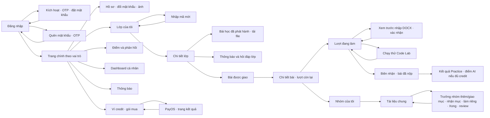
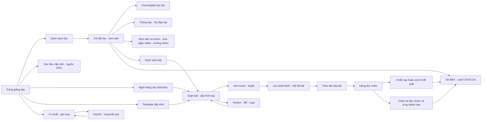
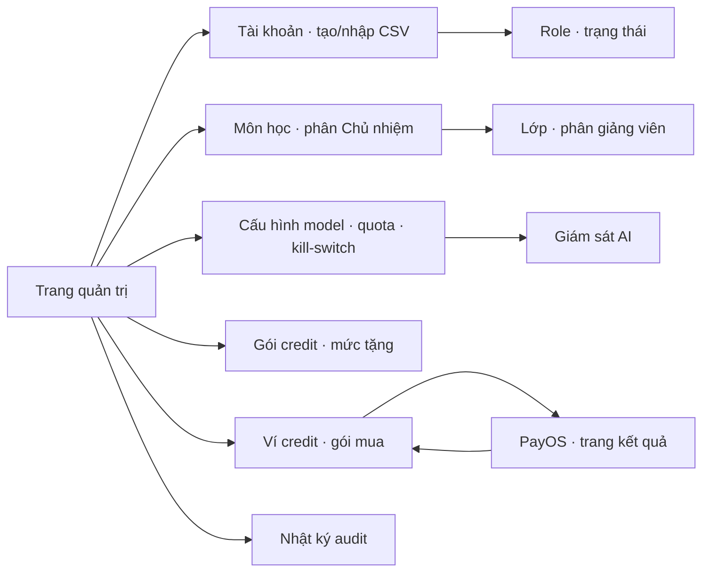

# Screen flow — các màn hình MVP

Bản vẽ đầy đủ nằm ở [screen-flow.drawio](screen-flow.drawio): Sign In ở giữa, nhánh tỏa ra theo menu từng vai trò; hình chữ nhật là màn hình hoặc menu, hình elip là popup ghi dữ liệu hoặc tải file; màu ô theo nhóm trong chú giải "Role-Based Screen Classification". Các sơ đồ Mermaid bên dưới là bản tóm tắt theo vai trò; danh sách ô chính xác nằm ở mục "Màn hình theo unit và UC".

Mũi tên là điều hướng chính; nhánh trong ngoặc là thao tác/dialog trên cùng trang. Tên route ở đây là định hướng từ `frontend-components.md`; API/URL cuối cùng được chốt khi triển khai. Tất cả màn hình đều phải kiểm quyền ở backend.

## 1. Truy cập chung và sinh viên

```mermaid
flowchart LR
    login["Đăng nhập"]
    activate["Kích hoạt · OTP · đặt mật khẩu"]
    reset["Quên mật khẩu · OTP"]
    shell["Trang chính theo vai trò"]
    profile["Hồ sơ · đổi mật khẩu · ảnh"]
    classes["Lớp của tôi"]
    join["Nhập mã mời"]
    classPage["Chi tiết lớp"]
    lesson["Bài học đã phát hành · tải file"]
    discussion["Thông báo và hỏi đáp lớp"]
    assignments["Bài được giao"]
    overview["Chi tiết bài · lượt còn lại"]
    attempt["Lượt đang làm"]
    docx["Xem trước nhập DOCX · xác nhận"]
    code["Chạy thử Code Lab"]
    receipt["Biên nhận · bài đã nộp"]
    practice["Kết quả Practice · điểm AI nếu đủ credit"]
    group["Nhóm của tôi"]
    groupDoc["Tài liệu chung"]
    section["Trưởng nhóm thêm/giao mục · nhận mục · làm riêng · Xong · review"]
    grades["Điểm và phản hồi"]
    dashboard["Dashboard cá nhân"]
    notifications["Thông báo"]
    credits["Ví credit · gói mua"]
    payment["PayOS · trang kết quả"]
    login --> shell
    login --> activate --> login
    login --> reset --> login
    shell --> profile
    shell --> classes
    classes --> join --> classes
    classes --> classPage
    classPage --> lesson
    classPage --> discussion
    classPage --> assignments --> overview --> attempt --> receipt
    attempt --> docx --> attempt
    attempt --> code --> attempt
    receipt --> practice
    overview --> group --> groupDoc --> section --> groupDoc
    shell --> grades
    shell --> dashboard
    shell --> notifications
    shell --> credits --> payment --> credits
```

**Diễn giải bằng chữ:** Sinh viên đăng nhập hoặc kích hoạt/khôi phục tài khoản (UC 1–6), vào các lớp đã ghi danh hoặc nhập mã mời (UC 10, UC 19), xem bài học và hỏi đáp (UC 12–14), mở bài được giao rồi bắt đầu một lượt (UC 29–31). Bài Diagram Essay cho phép xem trước DOCX và thêm block vào lượt đang làm; Code Lab cho chạy thử bằng Judge0, không dùng AI. Bài `PRACTICE` Text/Diagram Essay hiện điểm và phản hồi AI trong lượt đã nộp nếu sinh viên đủ credit khi nộp (UC 40). Bài nhóm mở tài liệu chung: trưởng nhóm thêm/sửa mục chi tiết dưới mục chính và giao cho thành viên, thành viên nhận hoặc làm mục được giao rồi bấm “Xong”; khi mọi mục xong, tài liệu vào review để cả nhóm xem lại, sau đó trưởng nhóm nộp (UC 15, UC 16). Sinh viên xem điểm đã công bố, dashboard và thông báo (UC 18, UC 35, UC 38), và có thể mua credit AI chỉ để dùng cho bài `PRACTICE` (UC 37).

## 2. Giảng viên và Chủ nhiệm môn

```mermaid
flowchart LR
    home["Trang giảng dạy"]
    classList["Danh sách lớp"]
    classDetail["Chi tiết lớp · sinh viên"]
    content["Chương/bài học lớp"]
    subjectContent["Học liệu cấp môn · nguồn RAG"]
    communication["Thông báo · hỏi đáp lớp"]
    bank["Ngân hàng câu hỏi/rubric"]
    templates["Template cấp môn"]
    assignmentList["Danh sách bài"]
    editor["Soạn bài · cấu hình loại"]
    groupSet["Sinh viên và nhóm · chia ngẫu nhiên · trưởng nhóm"]
    review["Xem trước · duyệt"]
    publish["Lịch phát hành · chế độ bài"]
    progress["Theo dõi nộp bài"]
    gradingQueue["Hàng đợi chấm"]
    grading["Chấm tay hoặc xem AI đề xuất"]
    groupGrading["Chấm tài liệu nhóm và từng thành viên"]
    gradebook["Sổ điểm · xuất CSV/XLSX"]
    version["Version · diff · copy"]
    credits["Ví credit · gói mua"]
    payment["PayOS · trang kết quả"]
    home --> classList --> classDetail
    classDetail --> content
    classDetail --> communication
    classDetail --> groupSet
    classDetail --> assignmentList --> editor
    home --> subjectContent
    home --> bank
    home --> templates --> editor
    bank --> editor
    editor --> review --> publish --> progress --> gradingQueue
    editor --> version --> editor
    gradingQueue --> grading --> gradebook
    gradingQueue --> groupGrading --> gradebook
    classDetail --> gradebook
    home --> credits --> payment --> credits
```

**Diễn giải bằng chữ:** Giảng viên quản lý lớp, chia nhóm ngay trong danh sách sinh viên của lớp (tạo tay hoặc chia ngẫu nhiên), nội dung và bài giao (UC 9, UC 11, UC 13); soạn một trong bốn loại bài cá nhân (UC 24–27) hoặc bài nhóm Group Assignment kèm các mục chính (UC 28), duyệt rồi phát hành (UC 28); có thể nhờ AI soạn đề từ nội dung lớp (UC 21). Sau khi có bài nộp `GRADED`, giảng viên theo dõi tiến độ, chấm tay hoặc yêu cầu AI đề xuất cho bài/phần được phép, chốt và công bố điểm, rồi xem/xuất sổ điểm và bật phân bố điểm ẩn danh cho sinh viên (UC 17, UC 32–34, UC 36). Bài `PRACTICE` không vào hàng đợi chấm. Chủ nhiệm môn có thêm học liệu RAG, rubric, ngân hàng câu hỏi của mọi dạng bài và template cấp môn, có thể nhờ AI tạo template từ RAG cấp môn (UC 11, UC 20, UC 22, UC 24–28); template phải được copy về lớp trước khi dùng. Cả hai vai trò được mua credit AI cho tài khoản của mình (UC 37). Bài đã phát hành bị khóa nội dung; khi mọi lần giao của version đã đóng/ngưng, nút sửa tạo version mới.

## 3. Quản trị viên

```mermaid
flowchart LR
    admin["Trang quản trị"]
    accounts["Tài khoản · tạo/nhập CSV"]
    accountDetail["Role · trạng thái"]
    subjects["Môn học · phân Chủ nhiệm"]
    classes["Lớp · phân giảng viên"]
    ai["Cấu hình model · quota · kill-switch"]
    usage["Giám sát AI"]
    packages["Gói credit · mức tặng"]
    credits["Ví credit · gói mua"]
    payment["PayOS · trang kết quả"]
    audit["Nhật ký audit"]
    admin --> accounts --> accountDetail
    admin --> subjects --> classes
    admin --> ai --> usage
    admin --> packages
    admin --> credits --> payment --> credits
    admin --> audit
```

**Diễn giải bằng chữ:** Quản trị viên tạo/nhập tài khoản (UC 7), phân công môn/lớp (UC 8, UC 9), cấu hình và giám sát AI, quản lý gói credit và mức tặng hằng tháng (UC 23), có thể mua credit cho tài khoản của mình (UC 37) và xem audit (UC 39). Không có màn hình hoàn tiền trong MVP hiện tại vì chính sách chưa chốt.

## Màn hình theo unit và UC

Bảng dưới liệt kê đúng các ô trong [screen-flow.drawio](screen-flow.drawio): 50 màn hình, 38 popup và 5 menu điều hướng (không tính chú giải màu). Sơ đồ chỉ ghi tên ô; unit và UC tra ở bảng này. Mã UC theo [bảng use case hiện hành](use-case-table.md); unit theo [story map](../aidlc-docs/inception/application-design/unit-of-work-story-map.md). Bảng xếp theo nhóm màu của chú giải "Role-Based Screen Classification": Common, Student, Admin, Subject Manager, Teacher và Class Screens.

- **Không có dashboard chung.** Đăng nhập xong U01 điều hướng theo vai trò tới trang đích (ghi `landing`): sinh viên → Dashboard (tổng quan học tập của UC 18: lớp đã ghi danh, bài sắp hạn, thông báo, trạng thái nộp, điểm đã công bố), giảng viên và Chủ nhiệm môn → My Teaching Classes, quản trị viên → Account List. Navigation là thanh đầu trang của mọi vai trò, chứa Profile, AI Credit Purchase và Notification.
- Chủ nhiệm môn thấy cả Teacher Menu (cùng link `/teaching`) và thêm Subject Manager Menu; trang cùng link chỉ vẽ một lần. Các màn hình nhóm Class Screens mở từ Class Detail của giảng viên.
- Sơ đồ chỉ vẽ màn hình và popup **tạo, sửa dữ liệu** hoặc **tải file**. Các thao tác sau nằm trong màn hình đã vẽ, không có ô riêng: nhập mã mời (My Classes, UC 10); bật, tắt hoặc tạo lại mã mời và bật phân bố điểm ẩn danh (tab `InviteCodeTab` và nút `GradeDistributionToggle` trên Class Detail của giảng viên, UC 9, UC 36); nhập tài khoản từ file (Account List, UC 7); nhập câu hỏi từ file và nhân bản (Question Bank, UC 24–28); copy template hoặc bài giữa lớp, phát hành và ngưng giao (Create Assignment, Assignment Detail, UC 28); AI soạn đề (Create Assignment, Create Template, UC 21–22); xem trước và nhập DOCX, chạy thử Code Lab (Attempt, UC 30); chấm bài nhóm, chốt và công bố điểm (Grading Detail, Grading Queue, UC 17, UC 34); cài đặt email thông báo (Notification, UC 38). Trang thanh toán PayOS là hệ thống ngoài, không vẽ thành ô.
- Ô có nhiều unit: unit đầu dựng trang, unit sau cung cấp component nhúng (ví dụ `AiDraftDialog` của U13 trong trình soạn U08). Tên component chi tiết nằm trong `frontend-components.md` của từng unit.
- Bảng phủ 40/40 UC và 16/16 unit. Mã cũ dạng `UC-XXX-NN` tra ở bảng Legacy UC codes của bảng use case.

| Unit | Số ô có tham gia |
|---|---|
| U01 | 12 |
| U02 | 1 |
| U03 | 2 |
| U04 | 22 |
| U05 | 12 |
| U06 | 5 |
| U07 | 6 |
| U08 | 5 |
| U09 | 5 |
| U10 | 5 |
| U11 | 5 |
| U12 | 7 |
| U13 | 7 |
| U14 | 4 |
| U15 | 7 |
| U16 | 8 |

| Unit | Ô | Loại | Vai trò | Mở từ | UC |
|---|---|---|---|---|---|
| U01 | Sign In | Màn hình | Chung | - | UC 2 (điều hướng theo vai trò) |
| U01 | Activate Account | Màn hình | Chung | Sign In | UC 1 |
| U01 | Forgot Password | Màn hình | Chung | Sign In | UC 4 |
| U01, U07, U16 | Navigation | Menu (không phải màn hình) | Chung | Sign In | - |
| U01, U03 | Profile | Màn hình | Chung | Navigation | UC 3 (nút đăng xuất), UC 6 |
| U01 | Change Password | Popup | Chung | Profile | UC 5 |
| U07 | AI Credit Purchase | Màn hình | Chung (cả bốn vai trò) | Navigation | UC 37 |
| U07 | Payment Result | Màn hình | Chung | AI Credit Purchase (sau PayOS) | UC 37 |
| U16 | Notification | Màn hình | Chung | Navigation | UC 38 |
| U01 | Student Menu | Menu (không phải màn hình) | Sinh viên | Sign In | - |
| U16 | Dashboard (landing) | Màn hình | Sinh viên | Student Menu | UC 18 |
| U04 | My Classes | Màn hình | Sinh viên | Student Menu | UC 10 (nhập mã mời), UC 19 |
| U04 | Class Detail | Màn hình | Sinh viên | My Classes | UC 19 |
| U04, U05 | Lesson Detail | Màn hình | Sinh viên | Class Detail | UC 12 |
| U05, U03 | Download Lesson | Popup | Sinh viên | Lesson Detail | UC 12 |
| U05 | Ask Question | Popup | Sinh viên | Class Detail | UC 14 |
| U08, U11 | Assignment Overview | Màn hình | Sinh viên | Class Detail | UC 29, UC 31 |
| U11, U09, U13 | Attempt | Màn hình | Sinh viên | Assignment Overview | UC 30 |
| U11 | Submitted Attempt View | Màn hình | Sinh viên | Attempt | UC 30, UC 31, UC 40 |
| U12 | My Group | Màn hình | Sinh viên | Assignment Overview | UC 15, UC 16 |
| U12 | Leader Change Request | Popup | Sinh viên | My Group | UC 15 |
| U14 | Group Document | Màn hình | Sinh viên | My Group | UC 16 |
| U14 | Manage Sections (Leader) | Popup | Sinh viên (trưởng nhóm) | Group Document | UC 16 |
| U14 | Section Work | Màn hình | Sinh viên | Group Document | UC 16 |
| U15 | My Grades | Màn hình | Sinh viên | Student Menu | UC 35 |
| U15 | Grade Detail | Màn hình | Sinh viên | My Grades | UC 35 |
| U01 | Admin Menu | Menu (không phải màn hình) | Quản trị viên | Sign In | - |
| U01 | Account List (landing) | Màn hình | Quản trị viên | Admin Menu | UC 7 |
| U01 | Create Account | Popup | Quản trị viên | Account List | UC 7 |
| U01 | Account Detail | Màn hình | Quản trị viên | Account List | UC 7 |
| U04 | Subject List | Màn hình | Quản trị viên | Admin Menu | UC 8 |
| U04 | Create Subject | Popup | Quản trị viên | Subject List | UC 8 |
| U04 | Edit Subject | Popup | Quản trị viên | Subject List | UC 8 |
| U04 | Assign Subject Manager | Popup | Quản trị viên | Subject List | UC 8 |
| U04 | Subject Detail | Màn hình | Quản trị viên | Subject List | UC 8 |
| U04 | Class List | Màn hình | Quản trị viên | Admin Menu | UC 9 |
| U04 | Create Class | Popup | Quản trị viên | Class List | UC 9 |
| U04 | Class Detail | Màn hình | Quản trị viên | Class List | UC 9 |
| U04 | Add Student | Popup | Quản trị viên | Class Detail | UC 9 |
| U04 | Edit Class | Popup | Quản trị viên | Class Detail | UC 9 |
| U04 | Assign Teacher | Popup | Quản trị viên | Class Detail | UC 9 |
| U15, U16 | Gradebook | Màn hình | Quản trị viên | Class Detail | UC 36 |
| U16 | Export Gradebook | Popup | Quản trị viên | Gradebook | UC 36 |
| U13 | AI Settings | Màn hình | Quản trị viên | Admin Menu | UC 23 |
| U13 | AI Usage Dashboard | Màn hình | Quản trị viên | AI Settings | UC 23 |
| U07 | Credit Packages | Màn hình | Quản trị viên | Admin Menu | UC 23 (gói credit, mức tặng hằng tháng) |
| U07 | Create Package | Popup | Quản trị viên | Credit Packages | UC 23 |
| U07 | Edit Package | Popup | Quản trị viên | Credit Packages | UC 23 |
| U02 | Audit Log | Màn hình | Quản trị viên | Admin Menu | UC 39 |
| U04 | Subject Manager Menu | Menu (không phải màn hình) | Chủ nhiệm môn | Sign In | - |
| U04 | My Subjects | Màn hình | Chủ nhiệm môn | Subject Manager Menu | UC 11 |
| U05 | Subject Content | Màn hình | Chủ nhiệm môn | My Subjects | UC 11 |
| U05 | Add Lesson | Popup | Chủ nhiệm môn | Subject Content | UC 11 |
| U05 | Edit Lesson | Popup | Chủ nhiệm môn | Subject Content | UC 11 |
| U04 | Subject Class List | Màn hình | Chủ nhiệm môn | My Subjects | UC 9 |
| U04 | Class Detail | Màn hình | Chủ nhiệm môn | Subject Class List | UC 9 |
| U10 | Subject Templates | Màn hình | Chủ nhiệm môn | Subject Manager Menu | UC 28 |
| U10, U09, U13 | Create Template | Popup | Chủ nhiệm môn | Subject Templates | UC 22, UC 24–28 |
| U10, U09 | Edit Template | Popup | Chủ nhiệm môn | Subject Templates | UC 24–28 |
| U01 | Teacher Menu | Menu (không phải màn hình) | GV và CN môn | Sign In | - |
| U04 | My Teaching Classes (landing) | Màn hình | GV và CN môn | Teacher Menu | UC 9 |
| U06 | Question Bank | Màn hình | GV và CN môn | Teacher Menu | UC 20, UC 24–28 |
| U06 | Create Question | Popup | GV và CN môn | Question Bank | UC 24–28 |
| U06 | Edit Question | Popup | GV và CN môn | Question Bank | UC 24–28 |
| U06 | Create Rubric | Popup | GV và CN môn | Question Bank | UC 20 |
| U06 | Edit Rubric | Popup | GV và CN môn | Question Bank | UC 20 |
| U04 | Class Detail | Màn hình | Giảng viên | My Teaching Classes | UC 9 (InviteCodeTab: mã mời), UC 36 (GradeDistributionToggle: bật phân bố điểm) |
| U04 | Add Student | Popup | Giảng viên | Class Detail | UC 9 |
| U04 | Edit Class | Popup | Giảng viên | Class Detail | UC 9 |
| U05 | Class Content | Màn hình | Giảng viên | Class Detail | UC 11 |
| U05 | Add Lesson | Popup | Giảng viên | Class Content | UC 11 |
| U05 | Edit Lesson | Popup | Giảng viên | Class Content | UC 11 |
| U05 | Class Communication | Màn hình | Giảng viên | Class Detail | UC 13, UC 14 |
| U05 | Post Announcement | Popup | Giảng viên | Class Communication | UC 13 |
| U05 | Reply Question | Popup | Giảng viên | Class Communication | UC 14 |
| U12 | Students & Groups | Màn hình | Giảng viên | Class Detail | UC 9 |
| U12 | Create Group | Popup | Giảng viên | Students & Groups | UC 9 |
| U12 | Edit Group | Popup | Giảng viên | Students & Groups | UC 9 |
| U12 | Random Split | Popup | Giảng viên | Students & Groups | UC 9 |
| U12 | Leader Change Request List | Popup | Giảng viên | Students & Groups | UC 9 (duyệt/từ chối yêu cầu của UC 15) |
| U08 | Assignment List | Màn hình | Giảng viên | Class Detail | UC 28 |
| U08, U09, U10, U13 | Create Assignment | Popup | Giảng viên | Assignment List | UC 21, UC 24–28 |
| U08, U09, U13 | Edit Assignment | Popup | Giảng viên | Assignment List | UC 21, UC 24–28 |
| U08 | Assignment Detail | Màn hình | Giảng viên | Assignment List | UC 28 |
| U10 | Version History | Màn hình | Giảng viên | Assignment Detail | UC 28 |
| U11, U14 | Submission List | Màn hình | Giảng viên | Assignment Detail | UC 28 (nhả khóa mục), UC 32 |
| U11 | Submission Detail | Màn hình | Giảng viên | Submission List | UC 32 |
| U16 | Submission Progress | Màn hình | Giảng viên | Submission List | UC 36 |
| U15 | Grading Queue | Màn hình | Giảng viên | Submission List | UC 32, UC 34 |
| U15 | Grading Detail | Màn hình | Giảng viên | Grading Queue | UC 17, UC 33, UC 34 |
| U13, U15 | AI Grading Suggestion | Popup | Giảng viên | Grading Detail | UC 17, UC 33 |
| U15, U16 | Gradebook | Màn hình | Giảng viên | Class Detail | UC 34, UC 36 |
| U16 | Export Gradebook | Popup | GV và CN môn | Gradebook | UC 36 |

## Điểm điều hướng và quyền cần giữ

| Màn hình/luồng | Quy tắc |
|---|---|
| Bài học và file lớp | Chỉ sinh viên ghi danh còn hiệu lực hoặc người quản lý có quyền; U04 kiểm quyền, U05 trả nội dung, U03 cấp token tải |
| DOCX của sinh viên | Chỉ trên lượt DOCUMENT đang `IN_PROGRESS`; xem trước rồi xác nhận, không ghi đè block khung giảng viên |
| Bài nhóm | Nhóm thuộc lớp và dùng cho mọi bài nhóm của lớp; chỉ trưởng nhóm thêm/giao mục chi tiết; trưởng nhóm chỉ nộp khi tài liệu ở `REVIEW`, hết hạn hệ thống tự nộp |
| Bài Practice | Hiện số lượt còn lại và kết quả luyện tập theo từng attempt; Teacher không chấm hoặc công bố điểm chính thức. Text/Diagram Essay chỉ có điểm AI nếu Student đủ credit khi nộp. |
| AI hỗ trợ chấm | Giảng viên chủ động yêu cầu; UI hiển thị đề xuất riêng với điểm cuối; giảng viên chấp nhận hoặc ghi đè |
| Hết quota AI / thiếu credit | Hai trạng thái lỗi riêng: “Hệ thống đang bận” / “Không đủ credit AI” |
| Sổ điểm | Điểm từng bài, không có điểm tổng/hệ số; sinh viên chỉ thấy điểm của mình đã công bố |

Nguồn: các file `functional-design/frontend-components.md` của [U01–U16](../aidlc-docs/construction/) và [quy tắc nghiệp vụ](../aidlc-docs/inception/requirements/requirements.md).
