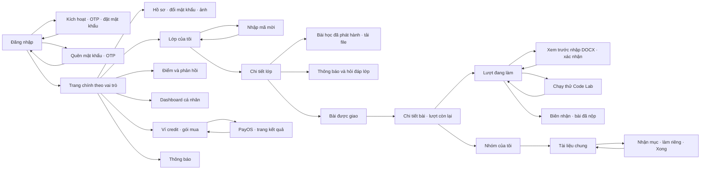
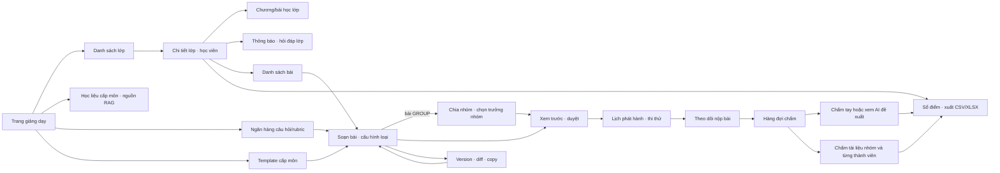
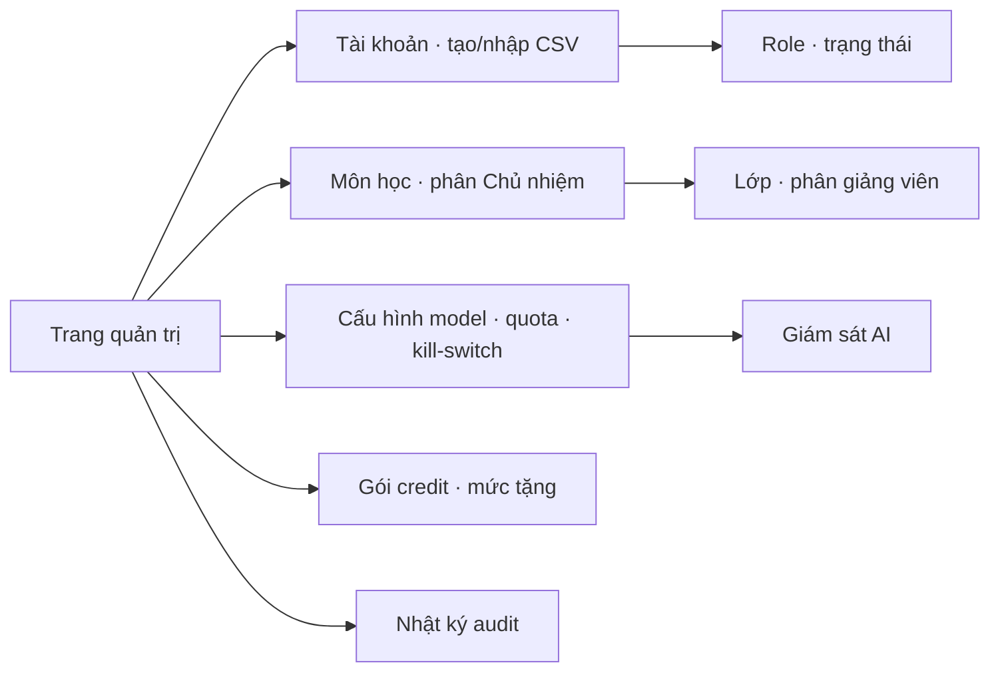

# Screen flow — các màn hình MVP

Bản vẽ đầy đủ nằm ở [screen-flow.drawio](screen-flow.drawio): Sign In ở giữa, nhánh tỏa ra theo menu từng vai trò; hình chữ nhật là màn hình, hình elip là popup ghi dữ liệu hoặc tải file, khung trắng có ô con là trang có tab, ô bo tròn viền đậm là menu của vai trò; ô xám nét đứt là hệ thống ngoài (PayOS).

Mũi tên là điều hướng chính; nhánh trong ngoặc là thao tác/dialog trên cùng trang. Tên route ở đây là định hướng từ `frontend-components.md`; API/URL cuối cùng được chốt khi triển khai. Tất cả màn hình đều phải kiểm quyền ở backend.

## 1. Truy cập chung và người học

```mermaid
flowchart LR
    login["Đăng nhập"]
    activate["Kích hoạt · OTP · đặt mật khẩu"]
    reset["Quên mật khẩu · OTP"]
    shell["Trang chính theo vai trò"]
    profile["Hồ sơ · đổi mật khẩu · ảnh"]
    classes["Lớp của tôi"]
    join["Nhập mã mời"]
    classPage["Chi tiết lớp"]
    lesson["Bài học đã phát hành · tải file"]
    discussion["Thông báo và hỏi đáp lớp"]
    assignments["Bài được giao"]
    overview["Chi tiết bài · lượt còn lại"]
    attempt["Lượt đang làm"]
    docx["Xem trước nhập DOCX · xác nhận"]
    code["Chạy thử Code Lab"]
    receipt["Biên nhận · bài đã nộp"]
    group["Nhóm của tôi"]
    groupDoc["Tài liệu chung"]
    section["Nhận mục · làm riêng · Xong"]
    grades["Điểm và phản hồi"]
    dashboard["Dashboard cá nhân"]
    credits["Ví credit · gói mua"]
    payment["PayOS · trang kết quả"]
    notifications["Thông báo"]
    login --> shell
    login --> activate --> login
    login --> reset --> login
    shell --> profile
    shell --> classes
    classes --> join --> classes
    classes --> classPage
    classPage --> lesson
    classPage --> discussion
    classPage --> assignments --> overview --> attempt --> receipt
    attempt --> docx --> attempt
    attempt --> code --> attempt
    overview --> group --> groupDoc --> section --> groupDoc
    shell --> grades
    shell --> dashboard
    shell --> credits --> payment --> credits
    shell --> notifications
```

**Diễn giải bằng chữ:** Người học đăng nhập hoặc kích hoạt/khôi phục tài khoản, vào các lớp đã ghi danh, xem bài học và hỏi đáp, mở bài được giao rồi bắt đầu một lượt. Bài DOCUMENT cho phép xem trước DOCX và thêm block vào lượt đang làm; Code Lab cho chạy thử. Bài nhóm mở tài liệu chung, thành viên nhận mục và bấm “Xong”; trưởng nhóm nộp. Người học xem điểm đã công bố, dashboard, ví credit và thông báo.

## 2. Giảng viên và Chủ nhiệm môn

```mermaid
flowchart LR
    home["Trang giảng dạy"]
    classList["Danh sách lớp"]
    classDetail["Chi tiết lớp · học viên"]
    content["Chương/bài học lớp"]
    subjectContent["Học liệu cấp môn · nguồn RAG"]
    communication["Thông báo · hỏi đáp lớp"]
    bank["Ngân hàng câu hỏi/rubric"]
    templates["Template cấp môn"]
    assignmentList["Danh sách bài"]
    editor["Soạn bài · cấu hình loại"]
    groupSet["Chia nhóm · chọn trưởng nhóm"]
    review["Xem trước · duyệt"]
    publish["Lịch phát hành · thi thử"]
    progress["Theo dõi nộp bài"]
    gradingQueue["Hàng đợi chấm"]
    grading["Chấm tay hoặc xem AI đề xuất"]
    groupGrading["Chấm tài liệu nhóm và từng thành viên"]
    gradebook["Sổ điểm · xuất CSV/XLSX"]
    version["Version · diff · copy"]
    home --> classList --> classDetail
    classDetail --> content
    classDetail --> communication
    classDetail --> assignmentList --> editor
    home --> subjectContent
    home --> bank
    home --> templates --> editor
    bank --> editor
    editor -->|"bài GROUP"| groupSet
    groupSet --> review
    editor --> review --> publish --> progress --> gradingQueue
    editor --> version --> editor
    gradingQueue --> grading --> gradebook
    gradingQueue --> groupGrading --> gradebook
    classDetail --> gradebook
```

**Diễn giải bằng chữ:** Giảng viên quản lý lớp, nội dung và bài giao; soạn một trong năm loại bài, cấu hình nhóm nếu là GROUP, duyệt rồi phát hành. Sau khi có bài nộp, giảng viên theo dõi tiến độ, chấm tay hoặc yêu cầu AI đề xuất cho bài/phần được phép, chốt và công bố điểm, rồi xem/xuất sổ điểm. Chủ nhiệm môn có thêm học liệu RAG, ngân hàng và template cấp môn; template phải được copy về lớp trước khi dùng. Bài đã phát hành bị khóa nội dung; khi mọi lần giao của version đã đóng/ngưng, nút sửa tạo version mới.

## 3. Quản trị viên

```mermaid
flowchart LR
    admin["Trang quản trị"]
    accounts["Tài khoản · tạo/nhập CSV"]
    accountDetail["Role · trạng thái"]
    subjects["Môn học · phân Chủ nhiệm"]
    classes["Lớp · phân giảng viên"]
    ai["Cấu hình model · quota · kill-switch"]
    usage["Giám sát AI"]
    packages["Gói credit · mức tặng"]
    audit["Nhật ký audit"]
    admin --> accounts --> accountDetail
    admin --> subjects --> classes
    admin --> ai --> usage
    admin --> packages
    admin --> audit
```

**Diễn giải bằng chữ:** Quản trị viên tạo/nhập tài khoản, phân công môn/lớp, cấu hình và giám sát AI, quản lý gói credit, xem audit. Không có màn hình hoàn tiền trong MVP hiện tại vì chính sách chưa chốt.

## Màn hình theo unit và UC

Bảng dưới liệt kê mọi ô trong [screen-flow.drawio](screen-flow.drawio) (57 màn hình, 15 tab, 81 popup), unit sẽ xây và UC mà ô đó phục vụ. Sơ đồ chỉ ghi tên ô; unit và UC tra ở bảng này. Mã UC theo [use-cases.md](../aidlc-docs/inception/user-stories/use-cases.md); unit theo [story map](../aidlc-docs/inception/application-design/unit-of-work-story-map.md).

- **Không có dashboard chung.** Đăng nhập xong U01 điều hướng theo role tới trang đích riêng (ghi `landing`): người học → Learner Dashboard, giảng viên và Chủ nhiệm môn → My Teaching Classes, quản trị viên → Account List. Ô bo tròn viền đậm (màu theo vai trò) là menu điều hướng, không phải màn hình.
- Chủ nhiệm môn thấy cả Instructor Menu (cùng link `/teaching`) và thêm Subject Manager Menu; trang cùng link chỉ vẽ một lần.
- Chỉ giữ popup **tạo, sửa hoặc xóa dữ liệu trong PostgreSQL** hoặc **tải file từ hệ thống**. Đã bỏ các popup/drawer chỉ đọc: xem trước bài/câu hỏi, lịch sử điểm, chi tiết audit, lịch sử version ngân hàng; bỏ panel Draw.io và nút đánh dấu mục việc (ghi cùng lúc lưu khung ở tab Type Config); bỏ Sign Out vì chỉ xóa phiên trong Redis (nút nằm ở trang Profile).
- Ô có nhiều unit: unit đầu dựng trang, unit sau cung cấp component nhúng (ví dụ `AiDraftDialog` của U13 trong trình soạn U08).
- Đủ 77/77 UC có ít nhất một ô; đủ 16/16 unit có ô (U03 chỉ có tải file và ảnh đại diện vì là hạ tầng).

| Unit | Số màn hình/tab/popup có tham gia |
|---|---|
| U01 | 13 |
| U02 | 1 |
| U03 | 2 |
| U04 | 33 |
| U05 | 18 |
| U06 | 7 |
| U07 | 6 |
| U08 | 14 |
| U09 | 5 |
| U10 | 8 |
| U11 | 11 |
| U12 | 7 |
| U13 | 12 |
| U14 | 8 |
| U15 | 11 |
| U16 | 7 |
| PayOS | 1 |

| Unit | Màn hình | Loại | Vai trò | Mở từ | UC |
|---|---|---|---|---|---|
| U01 | Sign In | Màn hình | Chung | - | UC-IAM-02 (redirect by role) |
| U01 | Activate Account (OTP) | Màn hình | Chung | Sign In | UC-IAM-01 |
| U01 | Forgot Password (OTP) | Màn hình | Chung | Sign In | UC-IAM-04 |
| U01 | Learner Menu | Menu (không phải màn hình) | Điều hướng | Sign In | - |
| U01 | Change Password Popup | Popup | Chung | Profile | UC-IAM-05 |
| U01, U03 | Upload Avatar Popup | Popup | Chung | Profile | UC-IAM-07 |
| U01 | Profile | Màn hình | Chung | Header (all roles) | UC-IAM-03, UC-IAM-06, UC-IAM-07 |
| U01 | Header (all roles) | Menu (không phải màn hình) | Điều hướng | Sign In | - |
| U01 | Create Account Popup | Popup | Quản trị viên | Account List (landing) | UC-IAM-09 |
| U01 | Import Preview & Confirm | Popup | Quản trị viên | Import Accounts (CSV) | UC-IAM-10 |
| U01 | Import Accounts (CSV) | Màn hình | Quản trị viên | Account List (landing) | UC-IAM-10 |
| U01 | Change Role Popup | Popup | Quản trị viên | Account Detail | UC-IAM-11 |
| U01 | Deactivate / Reactivate Confirmation | Popup | Quản trị viên | Account Detail | UC-IAM-12 |
| U01 | Account Detail | Màn hình | Quản trị viên | Account List (landing) | UC-IAM-08, UC-IAM-11, UC-IAM-12 |
| U01 | Account List (landing) | Màn hình | Quản trị viên | Admin Menu | UC-IAM-08 |
| U01 | Admin Menu | Menu (không phải màn hình) | Điều hướng | Sign In | - |
| U01 | Subject Manager Menu | Menu (không phải màn hình) | Điều hướng | Sign In | - |
| U01 | Instructor Menu (SM sees it too) | Menu (không phải màn hình) | Điều hướng | Sign In | - |
| U02 | Audit Log | Màn hình | Quản trị viên | Admin Menu | UC-OPS-02 |
| U03 | Download File | Popup | Người học | Lesson Viewer | UC-CNT-04 |
| U04, U16 | Learner Dashboard (landing) | Màn hình | Người học | Learner Menu | UC-LRN-01, UC-RPT-02 |
| U04 | Join Class by Code Popup | Popup | Người học | My Classes | UC-CAT-13 |
| U04, U05 | Lesson Viewer | Màn hình | Người học | Lessons | UC-CNT-04 |
| U04 | Class Page | Màn hình có tab | Người học | My Classes | UC-LRN-02 |
| U04 | Lessons | Tab | Người học | Class Page | UC-CNT-04 |
| U04 | My Classes | Màn hình | Người học | Learner Menu | UC-LRN-02 |
| U04 | Create / Edit Subject Popup | Popup | Quản trị viên | Subject List | UC-CAT-02, UC-CAT-03 |
| U04 | Assign Subject Manager Popup | Popup | Quản trị viên | Subject List | UC-CAT-04 |
| U04 | Subject List | Màn hình | Quản trị viên | Admin Menu | UC-CAT-01 |
| U04 | Create Class Popup | Popup | Quản trị viên | Class List (Admin) | UC-CAT-06 |
| U04 | Edit Class Popup | Popup | Quản trị viên | Class Info | UC-CAT-07 |
| U04 | Assign Instructor Popup | Popup | Quản trị viên | Class Info | UC-CAT-08 |
| U04 | Change Class State Confirmation | Popup | Quản trị viên | Class Info | UC-CAT-09 |
| U04 | Add Learner / List Popup | Popup | Quản trị viên | Enrollments | UC-CAT-11 |
| U04 | Remove Learner Confirmation | Popup | Quản trị viên | Enrollments | UC-CAT-12 |
| U04 | Class Detail (Admin) | Màn hình có tab | Quản trị viên | Class List (Admin) | UC-CAT-05 |
| U04 | Class Info | Tab | Quản trị viên | Class Detail (Admin) | UC-CAT-07..09 |
| U04 | Enrollments | Tab | Quản trị viên | Class Detail (Admin) | UC-CAT-10 |
| U04 | Class List (Admin) | Màn hình | Quản trị viên | Admin Menu | UC-CAT-05 |
| U04 | Subject Class List (opens Class Detail) | Màn hình | Chủ nhiệm môn | My Subjects | UC-CAT-05 |
| U04 | My Subjects | Màn hình | Chủ nhiệm môn | Subject Manager Menu | UC-CNT-01 |
| U04 | Edit Class Popup | Popup | Giảng viên | Class Info | UC-CAT-07 |
| U04 | Change Class State Confirmation | Popup | Giảng viên | Class Info | UC-CAT-09 |
| U04 | Grade Distribution Confirmation | Popup | Giảng viên | Class Info | UC-RPT-02 |
| U04 | Add Learner Popup | Popup | Giảng viên | Enrollments | UC-CAT-11 |
| U04 | Add Learner List Popup | Popup | Giảng viên | Enrollments | UC-CAT-11 |
| U04 | Remove Learner Confirmation | Popup | Giảng viên | Enrollments | UC-CAT-12 |
| U04 | Regenerate Code Confirmation | Popup | Giảng viên | Invite Code | UC-CAT-13 |
| U04 | Class Detail | Màn hình có tab | Giảng viên | My Teaching Classes (landing) | UC-CAT-05 |
| U04 | Class Info | Tab | Giảng viên | Class Detail | UC-CAT-07, UC-CAT-09 |
| U04 | Enrollments | Tab | Giảng viên | Class Detail | UC-CAT-10 |
| U04 | Invite Code | Tab | Giảng viên | Class Detail | UC-CAT-13 |
| U04 | My Teaching Classes (landing) | Màn hình | Giảng viên | Instructor Menu (SM sees it too) | UC-CAT-05 |
| U05 | Ask / Reply Question Popup | Popup | Người học | Announcements & Q&A | UC-CNT-07 |
| U05 | Announcements & Q&A | Tab | Người học | Class Page | UC-CNT-06, UC-CNT-07 |
| U05 | Add Chapter Popup | Popup | Chủ nhiệm môn | Subject Content (RAG) | UC-CNT-01 |
| U05 | Add YouTube Source Popup | Popup | Chủ nhiệm môn | Subject Lesson Editor | UC-CNT-08 |
| U05 | Publish Lesson Confirmation | Popup | Chủ nhiệm môn | Subject Lesson Editor | UC-CNT-01 |
| U05 | Retry Ingestion Confirmation | Popup | Chủ nhiệm môn | Subject Lesson Editor | UC-CNT-01 |
| U05 | Subject Lesson Editor | Màn hình | Chủ nhiệm môn | Subject Content (RAG) | UC-CNT-01, UC-CNT-08 |
| U05 | Subject Content (RAG) | Màn hình | Chủ nhiệm môn | My Subjects | UC-CNT-01 |
| U05 | Add Chapter Popup | Popup | Giảng viên | Class Content | UC-CNT-02 |
| U05 | Pick Subject Lesson Popup | Popup | Giảng viên | Class Content | UC-CNT-02 |
| U05 | Add YouTube Source Popup | Popup | Giảng viên | Lesson Editor | UC-CNT-08 |
| U05 | Publish Lesson Confirmation | Popup | Giảng viên | Lesson Editor | UC-CNT-03 |
| U05 | Lesson Editor | Màn hình | Giảng viên | Class Content | UC-CNT-02, UC-CNT-03, UC-CNT-08 |
| U05 | Class Content | Màn hình | Giảng viên | Class Detail | UC-CNT-02 |
| U05 | Post Announcement Popup | Popup | Giảng viên | Class Communication | UC-CNT-06 |
| U05 | Reply Question Popup | Popup | Giảng viên | Class Communication | UC-CNT-07 |
| U05 | Class Communication | Màn hình | Giảng viên | Class Detail | UC-CNT-06, UC-CNT-07 |
| U06 | Question Editor | Màn hình | GV và CN môn | Question Bank | UC-QBK-02 |
| U06 | Rubric Editor | Màn hình | GV và CN môn | Question Bank | UC-QBK-01 |
| U06 | Clone Popup | Popup | GV và CN môn | Question Bank | UC-QBK-01, UC-QBK-02 |
| U06 | Import Questions Popup | Popup | GV và CN môn | Question Bank | UC-QBK-02 |
| U06 | Archive Item Confirmation | Popup | GV và CN môn | Question Bank | UC-QBK-01, UC-QBK-02 |
| U06 | Question Bank | Màn hình | GV và CN môn | Instructor Menu (SM sees it too) | UC-QBK-01, UC-QBK-02 |
| U07 | Payment Result | Màn hình | Chung | PayOS Checkout (external) | UC-PAY-01 |
| U07 | Buy Package Confirmation | Popup | Chung | AI Credits | UC-PAY-01 |
| U07 | AI Credits | Màn hình | Chung | Header (all roles) | UC-PAY-01 |
| U07 | Create / Edit Package Popup | Popup | Quản trị viên | Credit Packages | UC-PAY-01 |
| U07 | Hide Package Confirmation | Popup | Quản trị viên | Credit Packages | UC-PAY-01 |
| U07 | Credit Packages | Màn hình | Quản trị viên | Admin Menu | UC-PAY-01 |
| U08, U13 | Template Editor | Màn hình | Chủ nhiệm môn | Subject Templates | UC-ASM-02..05, UC-AIG-02 |
| U08 | Create Assignment Popup | Popup | Giảng viên | Assignment List | UC-ASM-02..06 |
| U08, U06 | Add From Bank Popup | Popup | Giảng viên | Components | UC-ASM-03 |
| U08 | Clone Assignment Confirmation | Popup | Giảng viên | Assignment Editor | UC-ASM-15 |
| U08, U10 | Create New Version Confirmation | Popup | Giảng viên | Assignment Editor | UC-ASM-15 |
| U08 | Archive Assignment Confirmation | Popup | Giảng viên | Assignment Editor | UC-ASM-15 |
| U08 | Edit Schedule Popup | Popup | Giảng viên | Publication List | UC-ASM-07 |
| U08 | Retire Publication Confirmation | Popup | Giảng viên | Publication List | UC-ASM-15 |
| U08 | Publication List | Màn hình | Giảng viên | Publish Popup (schedule, simulation) | UC-ASM-07, UC-ASM-15 |
| U08, U10 | Publish Popup (schedule, simulation) | Popup | Giảng viên | Assignment Editor | UC-ASM-07, UC-ASM-18 |
| U08 | Assignment Editor | Màn hình có tab | Giảng viên | Assignment List | UC-ASM-02..06 |
| U08 | Instructions | Tab | Giảng viên | Assignment Editor | UC-ASM-02..06 |
| U08 | Components | Tab | Giảng viên | Assignment Editor | UC-ASM-02, UC-ASM-03, UC-ASM-05 |
| U08 | Assignment List | Màn hình | Giảng viên | Class Detail | UC-ASM-01 |
| U09 | Import DOCX Popup | Popup | Người học | Document | UC-ASM-12 |
| U09 | Import DOCX Skeleton Popup | Popup | Giảng viên | Type Config | UC-ASM-04 |
| U09 | Type Config | Tab | Giảng viên | Assignment Editor | UC-ASM-02..06, UC-GRP-05 |
| U10 | Release Template Confirmation | Popup | Chủ nhiệm môn | Subject Templates | UC-ASM-16 |
| U10 | Withdraw Template Confirmation | Popup | Chủ nhiệm môn | Subject Templates | UC-ASM-16 |
| U10 | Subject Templates | Màn hình | Chủ nhiệm môn | Subject Manager Menu | UC-ASM-16 |
| U10 | Copy From Template Popup | Popup | Giảng viên | Assignment List | UC-ASM-16 |
| U10 | Version History & Diff | Màn hình | Giảng viên | Assignment Editor | UC-ASM-15 |
| U10 | Copy To Class Popup | Popup | Giảng viên | Assignment Editor | UC-ASM-17 |
| U11 | Start Attempt Confirmation | Popup | Người học | Assignment Overview | UC-ASM-14, UC-ASM-18 |
| U11 | Submitted Attempt View | Màn hình | Người học | Submission Receipt | UC-ASM-14 |
| U11 | Submission Receipt | Màn hình | Người học | Submit Attempt Confirmation | UC-ASM-10..13 |
| U11 | Submit Attempt Confirmation | Popup | Người học | Attempt Workspace | UC-ASM-10..13 |
| U11 | Attempt Workspace | Màn hình có tab | Người học | Assignment Overview | UC-ASM-10..13, UC-ASM-18 |
| U11 | Quiz | Tab | Người học | Attempt Workspace | UC-ASM-11 |
| U11, U09 | Essay | Tab | Người học | Attempt Workspace | UC-ASM-10 |
| U11, U09 | Document | Tab | Người học | Attempt Workspace | UC-ASM-12 |
| U11, U13 | Code Lab | Tab | Người học | Attempt Workspace | UC-ASM-13 |
| U11 | Assignment Overview | Màn hình | Người học | Assignments | UC-ASM-09, UC-ASM-14, UC-ASM-18 |
| U11 | Assignments | Tab | Người học | Class Page | UC-ASM-09 |
| U12 | Leader Change Request Popup | Popup | Người học | My Group | UC-GRP-03 |
| U12 | My Group | Màn hình | Người học | Assignment Overview | UC-GRP-01 |
| U12 | Create / Edit Group Popup | Popup | Giảng viên | Group Set | UC-GRP-02 |
| U12 | Random Split Popup | Popup | Giảng viên | Group Set | UC-GRP-02 |
| U12 | Reuse Groups Popup | Popup | Giảng viên | Group Set | UC-GRP-02 |
| U12 | Approve / Reject Leader Request | Popup | Giảng viên | Group Set | UC-GRP-04 |
| U12 | Group Set | Màn hình | Giảng viên | Assignment Editor | UC-GRP-01, UC-GRP-02, UC-GRP-04 |
| U13 | Try Run Popup | Popup | Người học | Code Lab | UC-ASM-13 |
| U13 | Kill-Switch Confirmation | Popup | Quản trị viên | AI Settings | UC-AIG-03 |
| U13 | AI Usage Dashboard | Màn hình | Quản trị viên | AI Settings | UC-AIG-03 |
| U13 | AI Settings | Màn hình | Quản trị viên | Admin Menu | UC-AIG-03 |
| U13 | AI Draft Questions Popup | Popup | Giảng viên | Components | UC-AIG-01 |
| U13 | Verify Code Solution | Popup | Giảng viên | Type Config | UC-ASM-05 |
| U13 | AI Grading Suggestion Panel | Popup | Giảng viên | Grading Workspace | UC-GRD-03 |
| U13 | AI Grading Suggestion Panel | Popup | Giảng viên | Group Grading | UC-GRD-03, UC-GRP-08 |
| U13 | Verify Code Solution | Popup | GV và CN môn | Question Editor | UC-ASM-05 |
| U13 | AI Draft Questions Popup | Popup | GV và CN môn | Question Bank | UC-AIG-01, UC-AIG-02 |
| U14 | Add Section Popup | Popup | Người học | Group Document | UC-GRP-06 |
| U14 | Mark Section Done Confirmation | Popup | Người học | Section Work | UC-GRP-06 |
| U14 | Release Section Confirmation | Popup | Người học | Section Work | UC-GRP-05, UC-GRP-06 |
| U14 | Section Work | Màn hình | Người học | Group Document | UC-GRP-06 |
| U14 | Submit Group Confirmation | Popup | Người học | Group Document | UC-GRP-07 |
| U14 | Group Document | Màn hình | Người học | My Group | UC-GRP-06, UC-GRP-07 |
| U14 | Release Section Lock Confirmation | Popup | Giảng viên | Group Docs Overview | UC-GRP-05 |
| U14 | Group Docs Overview | Màn hình | Giảng viên | Publication List | UC-GRP-07 |
| U15 | Grade Detail & Feedback | Màn hình | Người học | My Grades | UC-GRD-06 |
| U15 | My Grades | Màn hình | Người học | Learner Menu | UC-GRD-06 |
| U15 | Gradebook (Admin) | Màn hình | Quản trị viên | Class Detail (Admin) | UC-GRD-07 |
| U15 | Bulk Finalize Popup | Popup | Giảng viên | Grading Queue | UC-GRD-05 |
| U15 | Publish Grades Confirmation | Popup | Giảng viên | Grading Queue | UC-GRD-04 |
| U15 | Override Reason Popup | Popup | Giảng viên | Grading Workspace | UC-GRD-02, UC-GRD-03 |
| U15 | Grading Workspace | Màn hình | Giảng viên | Grading Queue | UC-GRD-01..04 |
| U15 | Member Final Grade Popup | Popup | Giảng viên | Group Grading | UC-GRP-08 |
| U15 | Group Grading | Màn hình | Giảng viên | Grading Queue | UC-GRP-08 |
| U15 | Grading Queue | Màn hình | Giảng viên | Publication List | UC-GRD-01 |
| U15 | Gradebook | Màn hình | Giảng viên | Class Detail | UC-GRD-07 |
| U16 | Notification Settings | Màn hình | Chung | Notification List | UC-OPS-01 |
| U16 | Notification List | Màn hình | Chung | Notification Dropdown | UC-OPS-01 |
| U16 | Notification Dropdown | Popup | Chung | Header (all roles) | UC-OPS-01 |
| U16 | Export CSV / XLSX Popup | Popup | Quản trị viên | Gradebook (Admin) | UC-RPT-03 |
| U16 | Submission Progress | Màn hình | Giảng viên | Publication List | UC-RPT-01 |
| U16 | Export CSV / XLSX Popup | Popup | Giảng viên | Gradebook | UC-RPT-03 |
| PayOS | PayOS Checkout (external) | Ngoài hệ thống | Hệ thống ngoài | Buy Package Confirmation | UC-PAY-01 |

## Điểm điều hướng và quyền cần giữ

| Màn hình/luồng | Quy tắc |
|---|---|
| Bài học và file lớp | Chỉ học viên ghi danh còn hiệu lực hoặc người quản lý có quyền; U04 kiểm quyền, U05 trả nội dung, U03 cấp token tải |
| DOCX của người học | Chỉ trên lượt DOCUMENT đang `IN_PROGRESS`; xem trước rồi xác nhận, không ghi đè block khung giảng viên |
| Thi thử | Hiện số lượt còn lại, cách lấy kết quả `HIGHEST/LATEST/AVERAGE` và có/không tính điểm |
| AI hỗ trợ chấm | Giảng viên chủ động yêu cầu; UI hiển thị đề xuất riêng với điểm cuối; giảng viên chấp nhận hoặc ghi đè |
| Hết quota AI / thiếu credit | Hai trạng thái lỗi riêng: “Hệ thống đang bận” / “Không đủ credit AI” |
| Sổ điểm | Điểm từng bài, không có điểm tổng/hệ số; người học chỉ thấy điểm của mình đã công bố |

Nguồn: các file `functional-design/frontend-components.md` của [U01–U16](../aidlc-docs/construction/) và [quy tắc nghiệp vụ](../aidlc-docs/inception/requirements/requirements.md).
