# Use case — 78 mục MVP

Mỗi sơ đồ là một lát cắt của cùng hệ thống. Actor được ghi đúng như catalog; nhãn có dấu / biểu thị các vai trò đều có thể thực hiện use case đó. Mỗi mã UC xuất hiện đúng một lần. Hệ thống ngoài nằm trong [context diagram](context-diagram.md).

Nguồn: [catalog use case](../aidlc-docs/inception/user-stories/use-cases.md) và [ánh xạ unit](../aidlc-docs/inception/application-design/unit-of-work-story-map.md).

## Identity and Access Management

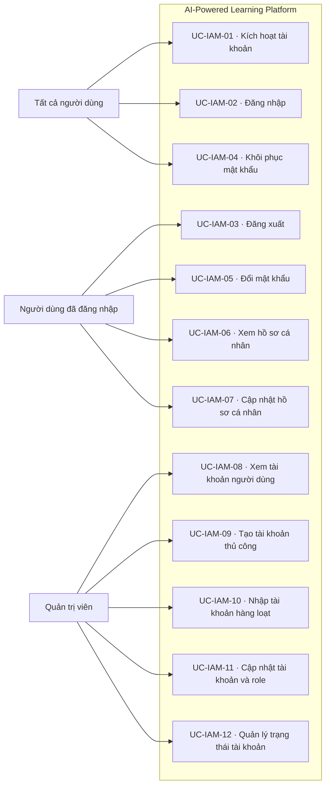

**Diễn giải bằng chữ:** UC-IAM-01 — Kích hoạt tài khoản; UC-IAM-02 — Đăng nhập; UC-IAM-03 — Đăng xuất; UC-IAM-04 — Khôi phục mật khẩu; UC-IAM-05 — Đổi mật khẩu; UC-IAM-06 — Xem hồ sơ cá nhân; UC-IAM-07 — Cập nhật hồ sơ cá nhân; UC-IAM-08 — Xem tài khoản người dùng; UC-IAM-09 — Tạo tài khoản thủ công; UC-IAM-10 — Nhập tài khoản hàng loạt; UC-IAM-11 — Cập nhật tài khoản và role; UC-IAM-12 — Quản lý trạng thái tài khoản.

## Academic Structure and Enrollment

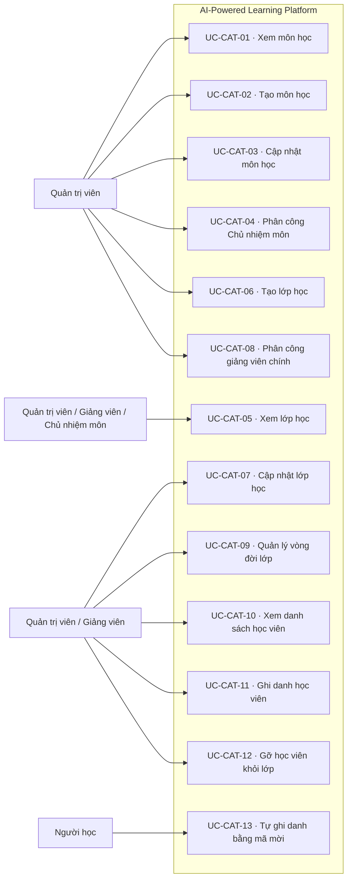

**Diễn giải bằng chữ:** UC-CAT-01 — Xem môn học; UC-CAT-02 — Tạo môn học; UC-CAT-03 — Cập nhật môn học; UC-CAT-04 — Phân công Chủ nhiệm môn; UC-CAT-05 — Xem lớp học; UC-CAT-06 — Tạo lớp học; UC-CAT-07 — Cập nhật lớp học; UC-CAT-08 — Phân công giảng viên chính; UC-CAT-09 — Quản lý vòng đời lớp; UC-CAT-10 — Xem danh sách học viên; UC-CAT-11 — Ghi danh học viên; UC-CAT-12 — Gỡ học viên khỏi lớp; UC-CAT-13 — Tự ghi danh bằng mã mời.

## Learning Content and RAG

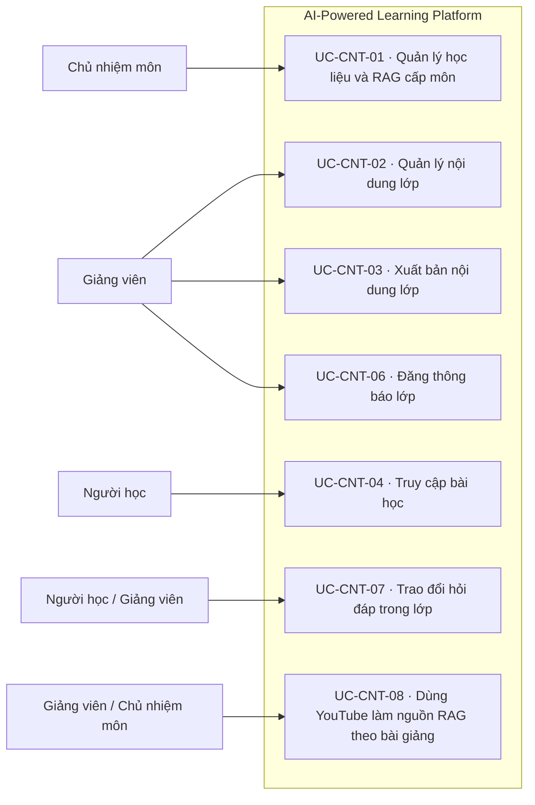

**Diễn giải bằng chữ:** UC-CNT-01 — Quản lý học liệu và RAG cấp môn; UC-CNT-02 — Quản lý nội dung lớp; UC-CNT-03 — Xuất bản nội dung lớp; UC-CNT-04 — Truy cập bài học; UC-CNT-06 — Đăng thông báo lớp; UC-CNT-07 — Trao đổi hỏi đáp trong lớp; UC-CNT-08 — Dùng YouTube làm nguồn RAG theo bài giảng.

## Group Management and Group Assignment

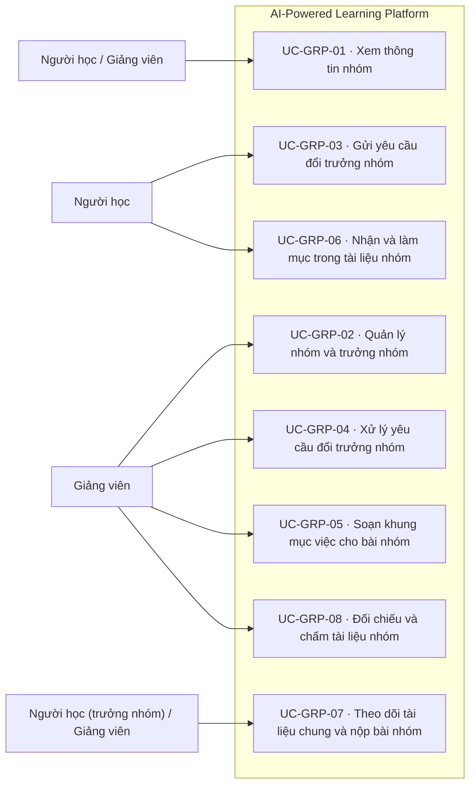

**Diễn giải bằng chữ:** UC-GRP-01 — Xem thông tin nhóm; UC-GRP-02 — Quản lý nhóm và trưởng nhóm; UC-GRP-03 — Gửi yêu cầu đổi trưởng nhóm; UC-GRP-04 — Xử lý yêu cầu đổi trưởng nhóm; UC-GRP-05 — Soạn khung mục việc cho bài nhóm; UC-GRP-06 — Nhận và làm mục trong tài liệu nhóm; UC-GRP-07 — Theo dõi tài liệu chung và nộp bài nhóm; UC-GRP-08 — Đối chiếu và chấm tài liệu nhóm.

## Learning Journey

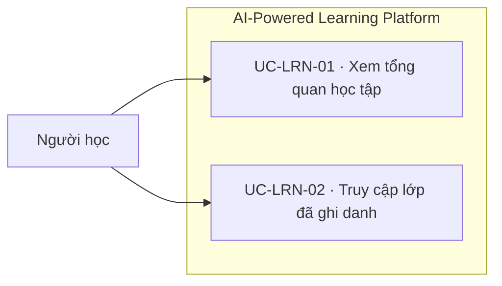

**Diễn giải bằng chữ:** UC-LRN-01 — Xem tổng quan học tập; UC-LRN-02 — Truy cập lớp đã ghi danh.

## Question and Rubric Bank

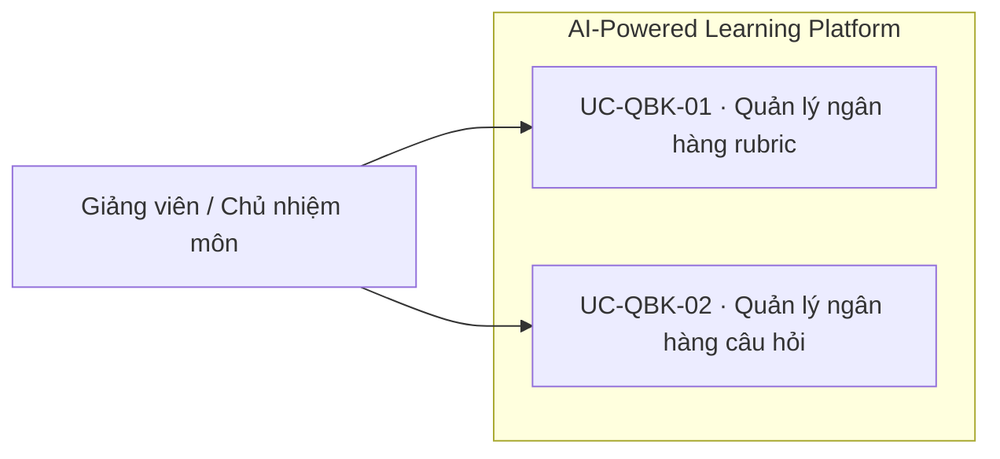

**Diễn giải bằng chữ:** UC-QBK-01 — Quản lý ngân hàng rubric; UC-QBK-02 — Quản lý ngân hàng câu hỏi.

## AI-Assisted Authoring and Administration

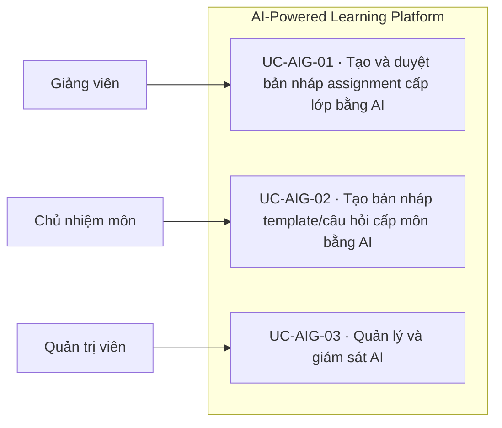

**Diễn giải bằng chữ:** UC-AIG-01 — Tạo và duyệt bản nháp assignment cấp lớp bằng AI; UC-AIG-02 — Tạo bản nháp template/câu hỏi cấp môn bằng AI; UC-AIG-03 — Quản lý và giám sát AI.

## Assignment Authoring and Submission

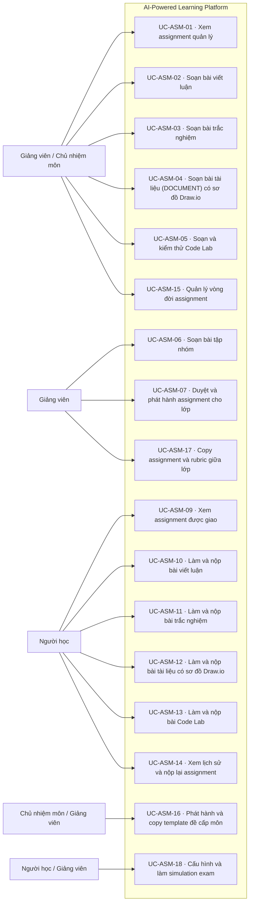

**Diễn giải bằng chữ:** UC-ASM-01 — Xem assignment quản lý; UC-ASM-02 — Soạn bài viết luận; UC-ASM-03 — Soạn bài trắc nghiệm; UC-ASM-04 — Soạn bài tài liệu (DOCUMENT) có sơ đồ Draw.io; UC-ASM-05 — Soạn và kiểm thử Code Lab; UC-ASM-06 — Soạn bài tập nhóm; UC-ASM-07 — Duyệt và phát hành assignment cho lớp; UC-ASM-09 — Xem assignment được giao; UC-ASM-10 — Làm và nộp bài viết luận; UC-ASM-11 — Làm và nộp bài trắc nghiệm; UC-ASM-12 — Làm và nộp bài tài liệu có sơ đồ Draw.io; UC-ASM-13 — Làm và nộp bài Code Lab; UC-ASM-14 — Xem lịch sử và nộp lại assignment; UC-ASM-15 — Quản lý vòng đời assignment; UC-ASM-16 — Phát hành và copy template đề cấp môn; UC-ASM-17 — Copy assignment và rubric giữa lớp; UC-ASM-18 — Cấu hình và làm simulation exam.

## Grading and Feedback

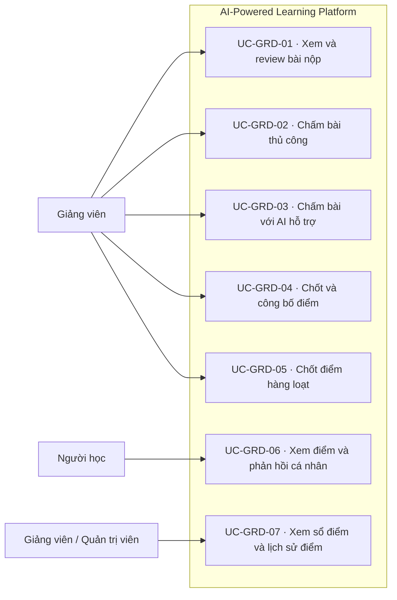

**Diễn giải bằng chữ:** UC-GRD-01 — Xem và review bài nộp; UC-GRD-02 — Chấm bài thủ công; UC-GRD-03 — Chấm bài với AI hỗ trợ; UC-GRD-04 — Chốt và công bố điểm; UC-GRD-05 — Chốt điểm hàng loạt; UC-GRD-06 — Xem điểm và phản hồi cá nhân; UC-GRD-07 — Xem sổ điểm và lịch sử điểm.

## Reporting and Analytics

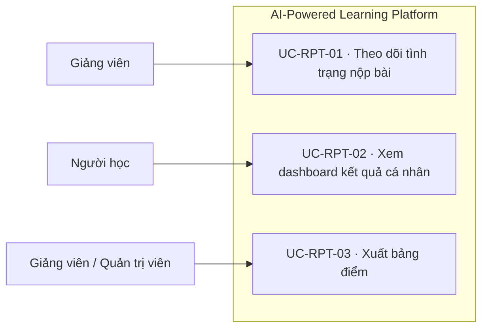

**Diễn giải bằng chữ:** UC-RPT-01 — Theo dõi tình trạng nộp bài; UC-RPT-02 — Xem dashboard kết quả cá nhân; UC-RPT-03 — Xuất bảng điểm.

## Payment

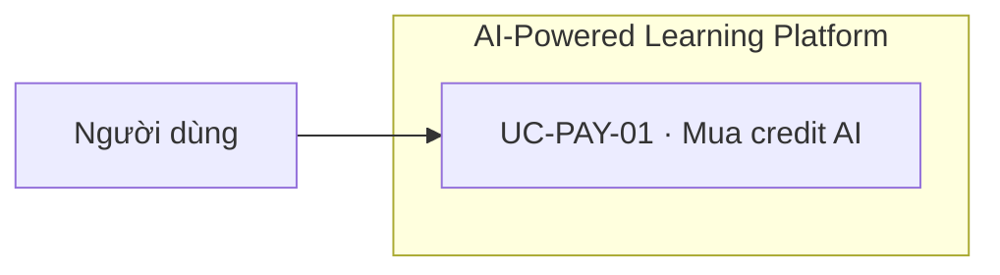

**Diễn giải bằng chữ:** UC-PAY-01 — Mua credit AI; khi thiếu webhook, hệ thống tự xác minh trạng thái qua PayOS.

## Notification and Audit

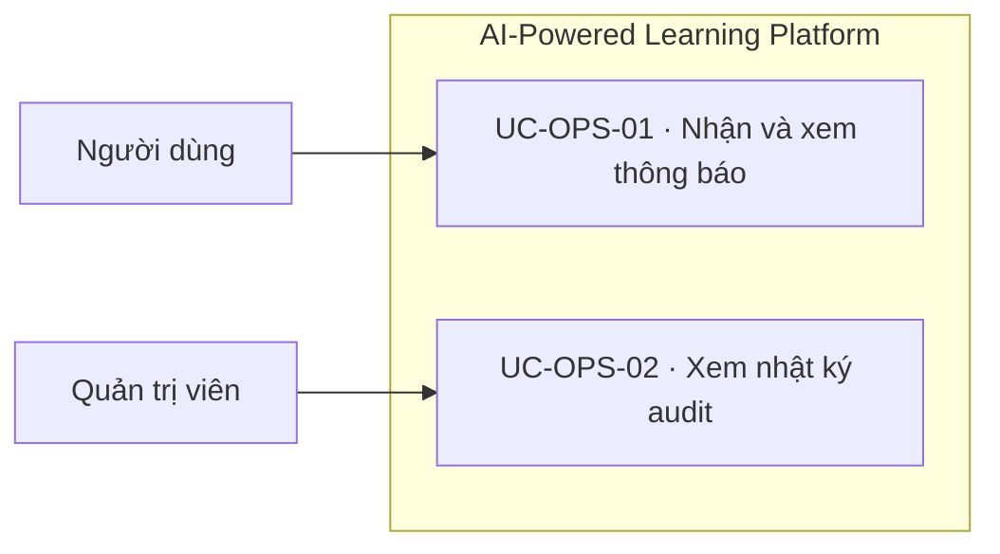

**Diễn giải bằng chữ:** UC-OPS-01 — Nhận và xem thông báo; UC-OPS-02 — Xem nhật ký audit.

## Kiểm soát phạm vi

- 77 UC thuộc một MVP; không có catalog Phase 2.
- AI chỉ tạo bản nháp hoặc đề xuất; giảng viên chốt điểm cuối.
- Không có use case hoàn tiền sau giao dịch đã trả vì chính sách chưa chốt.
- Screen flow theo vai trò xem tại [screen-flow.md](screen-flow.md).
